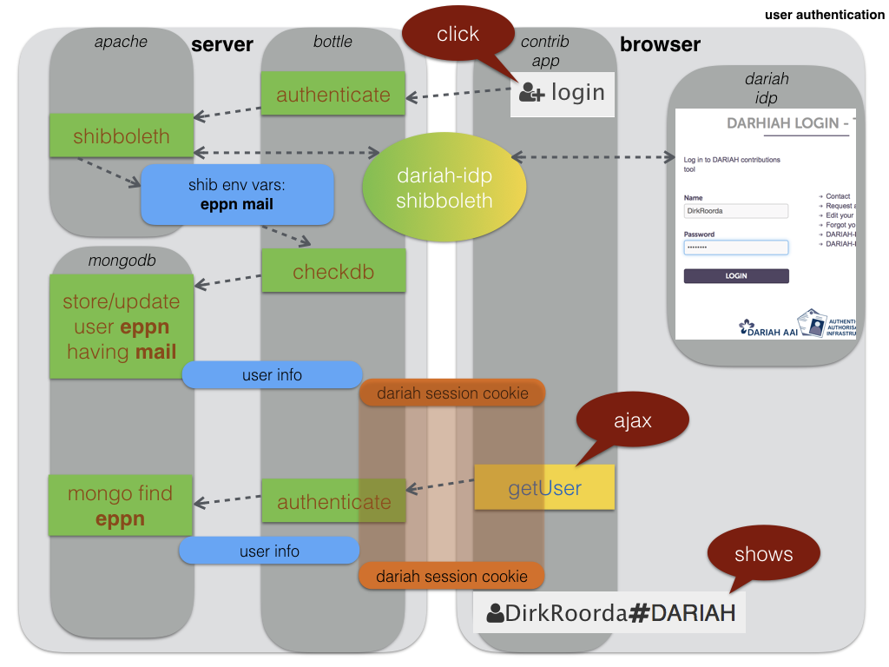
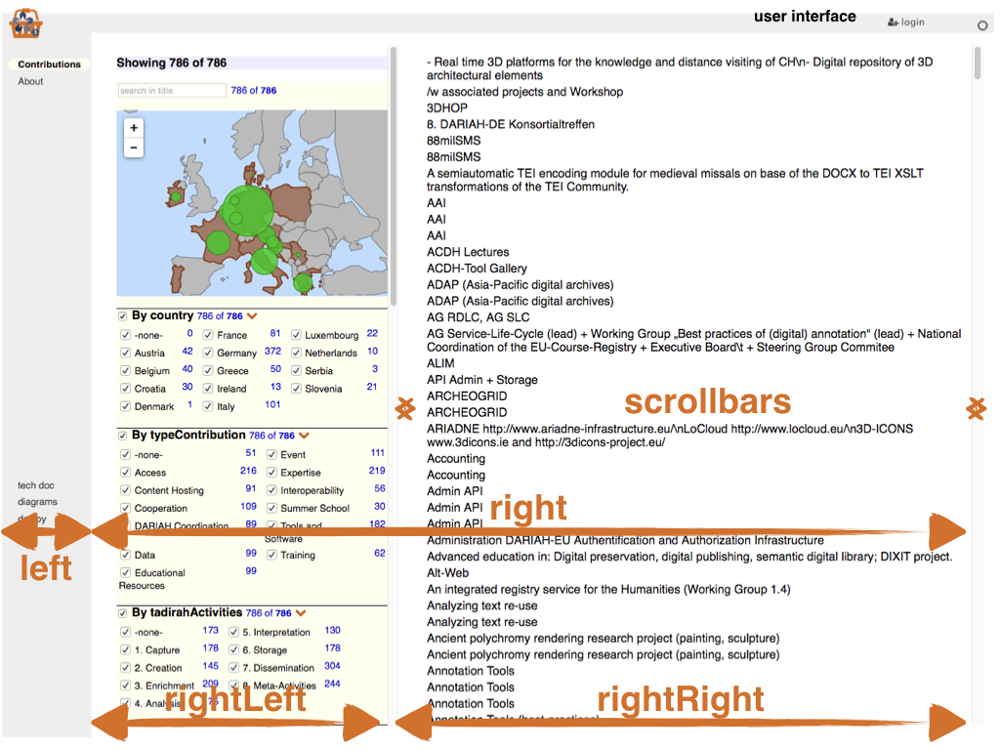

# Diagrams

==[Architecture](../Concepts/Architecture.md)==

[{:width="300px"}](../Concepts/Architecture.md#overview)

[{:width="300px"}](../Concepts/Architecture.md#dux)

==[Authentication](../Server/Authentication.md)==

[{:width="300px"}](../Server/Authentication.md)

==[Business](../Functionality/Business.md)==

[{:width="300px"}](../Functionality/Business.md#consolidation)

==[Components](../Client/Components.md)==

[{:width="300px"}](../Client/Components.md#errorboundary)

[{:width="300px"}](../Client/Components.md#relselect)

==[Dux](../Client/Dux.md)==

[{:width="300px"}](../Client/Dux.md#filters)

[{:width="300px"}](../Client/Dux.md#win)

[{:width="300px"}](../Client/Dux.md#notes)

==[Routing](../Concepts/Routing.md)==

[{:width="300px"}](../Concepts/Routing.md#routing)

==[Workflow](../Functionality/Workflow.md)==

[{:width="300px"}](../Functionality/Workflow.md#description)

[{:width="300px"}](../Functionality/Workflow.md#wiring)
