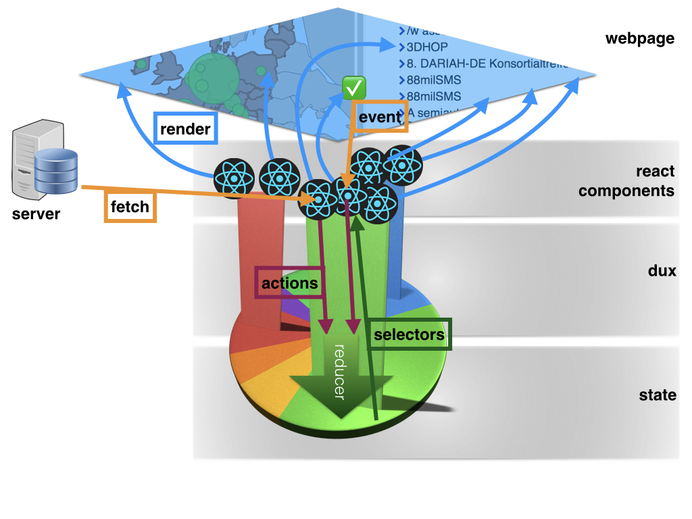
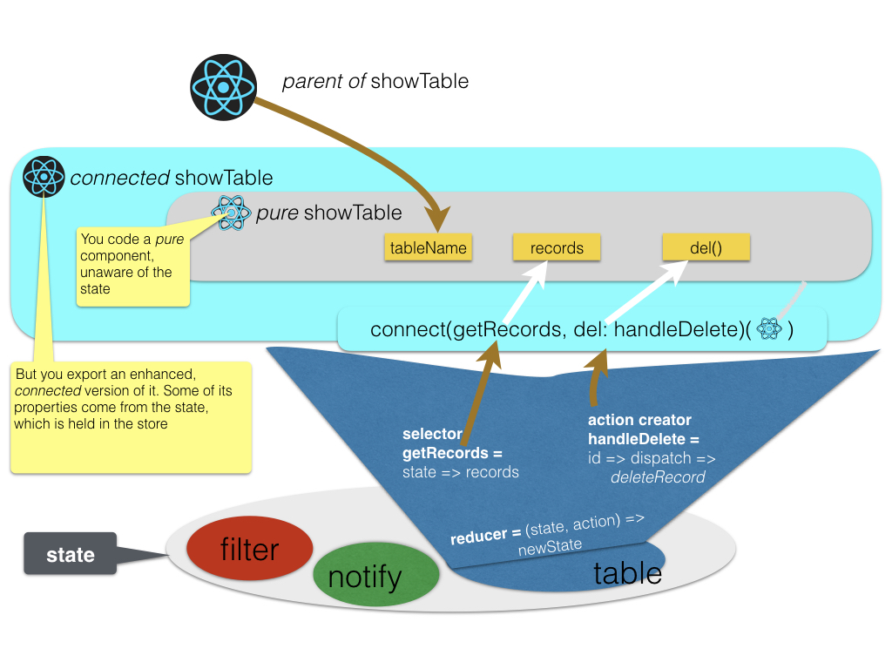

# Introduction
This app consists of many [React](React) components.
By default React components have a private state where they can store everything that changes
in their life course. That is: user interaction and server data.

If many components handle overlapping data, problems arise, and they manifest themselves first as subtle bugs.
Hard to reproduce, hard to fix. Because they have to do with unpredictable timing of changing entities.

That is where [Redux](React#redux) comes to the rescue.
Redux provides a central state as a *single source of truth*.
Redux itself is a very small library, under 600 lines of code, but using it will have a dramatic effect on
all your React components, especially if you use Redux in an idiomatic way.

# Overview


# Components and Dux
In Redux, every component has read access to the state, and indirect write access by *dispatching* *actions*.
The state is held in a store and the store manages all access to the state.
When actions are dispatched to the store, the store calls a *reducer*,
which is a function written by the application developer and subscribed to the store.

The reducer is given the action, which has a *type* and a payload, and on that basis, and that basis alone,
it produces a new state from the old state.

An app has many concerns, some of which are pretty well separable from others.
Such a concern tends to be centered around a specific slice of the state,
involving a specific set of actions, and a dedicated partial reducer of that slice of the state.
The components involved do not need the whole state, but a specific *selection* of the state.
Some of the actions may become really specialized, involved, and complex, and for those
one writes dedicated *helpers*.

We have organized these concerns into *dux* (plural of *duck*), where a duck is one file of [ES6](ES6) code that
exports

* *action* creator functions (one or more as named exports); their names typically start with `handle`, `change`, `fetch`;
  `fetch` as in "asynchronously fetch data from the server".
* a single *reducer* function (as the default export);
* *selector* functions (one or more as named exports); their names always start with `get`;
  `get` as in: "get a fragment of the whole state".
* *helper* functions (some of which do not have to be exported).

Such a *duck* ties in very well with the way that React components can be connected to the state.
The idiomatic approach is to write your component as a pure, stateless function, even if it needs state.
When it does need to read the state, assume that your component will receive that information as *properties*.
And when it needs to modify the state, assume that it will receive callbacks, also as *properties*, to dispatch actions.
See also [connect](React#connect).

# Dux as glue between components and the state
If you have written your component, say `MyComp`, and you need a piece of the state `mySlice` that is provided by a *selector*
`getMySlice`, and you need to dispatch an action `handle` in response of a user click, and the action creator
`changeSlice` provides that, then you can wrap your component by means of the Redux higher order function `connect` like this:

```es6
    export connect(getMySlice, { handle: changeSlice })(MyComp)
```

In this way, most components that deal with change can still be written as pure functions, relatively easy to understand,
while the response to change is expressed in a very simple pattern.
This will reduce the potential bugs considerably.



Note that all code to make the connection between components and a (slice of the) state are located in a duck.
We are talking about the *selectors*, the *actions*, and possibly the *helpers*.
The reducer is something that is hidden from the component code.
It is only used by the store, via a kind of subscription.
The structure of the reducer follows the types of the actions very closely
so it really makes sense to have all four things in one file.

# The dux of this app
Currently, these are the dux of this app:

* [alter](Dux#alter): show/hide, cycle through *n* alternative representations of a piece of user interface;
* [docs](Dux#docs): fetch documents, especially markdown ones, and show them in two representations: source and formatted;
* [filters](Dux#filters): the machinery of faceted and full text filtering of entities from tables;
* [me](Dux#me): data about the currently logged-in user;
* [notes](Dux#notes): the notification system;
* [roots](Dux#roots): combining all the other dux;
* [select](Dux#select): the state of all multiselect widgets in the app;
* [tables](Dux#tables): manage all database data that has been fetched from the server;
* [win](Dux#win): react to the resizing of the browser window.

