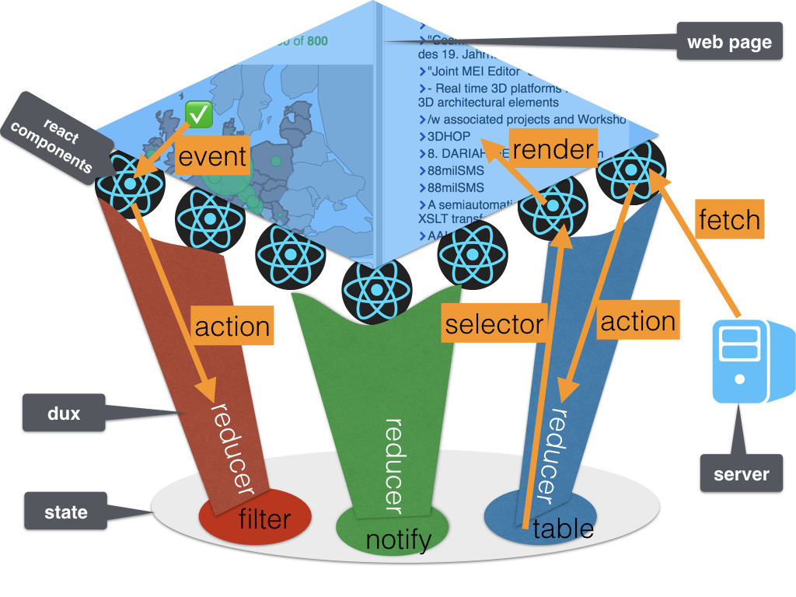
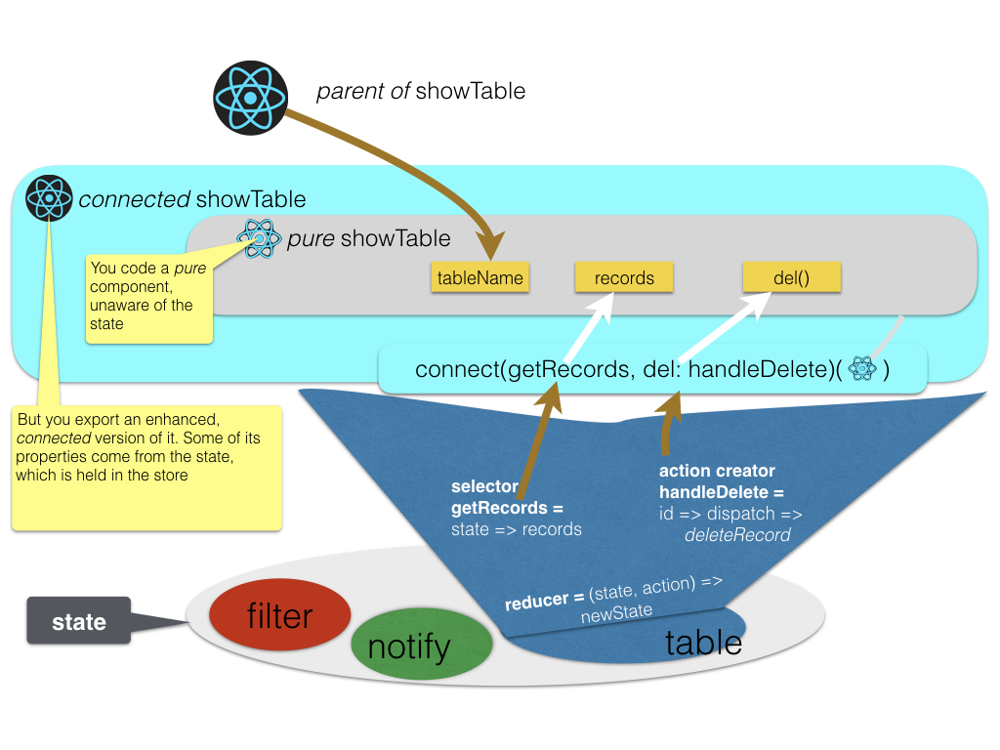

# Introduction

This app consists of many [React](React) components. By default React components
have a private state where they can store everything that changes in their life
courses. That is: user interaction and server data.

If many components handle overlapping data, problems arise, and they manifest
themselves first as subtle bugs. Hard to reproduce, hard to fix, because they
have to do with unpredictable timing of changing entities.

That is where [Redux](React#redux) comes to the rescue. Redux provides a central
state as a _single source of truth_. Redux itself is a very small library, under
600 lines of code, but using it will have a dramatic effect on all your React
components, especially if you use Redux in an _idiomatic_ way.

# Overview



# [Components](Components) and [Dux](Dux)

In Redux, every component may obtain read access to the state, and has indirect
write access to it by _dispatching_ _actions_. The state is held in a _store_
and the store manages all access to the state. When actions are dispatched to
the store, the store calls a _reducer_, which is a function written by the
application developer.

The reducer is given the action, which has a _type_ and a payload, and on that
basis, and that basis alone, it produces a new state from the old state.

An app has many concerns, some of which are pretty well separable from others.
Such a concern tends to be centred around a specific slice of the state,
involving a specific set of actions, and a dedicated partial reducer of that
slice. The components involved do not need the whole state, but only this
specific slice of the state. Some of the actions may become really specialized,
involved, and complex, and for those one writes dedicated _helpers_.

We have organized these concerns into _dux_ (plural of _duct_ or more
affectionately: _duck_), where a duct is one file of [ES6](ES6) code that
exports

* _action_ creator functions (one or more as named exports); their names
  typically start with `handle`, `change`, `fetch`; `fetch` as in
  "asynchronously fetch data from the server".
* a single _reducer_ function (as the default export);
* _selector_ functions (one or more as named exports); their names always start
  with `get`; `get` as in: "get a fragment of the whole state".
* _helper_ functions (some of which do not have to be exported); quite often
  their names start with `compile` as in "compile the state data into something
  that may component can readily consume".

Such a _duct_ ties in very well with the way that React components can be
connected to the state. The idiomatic approach is to write your component as a
pure, stateless function, even if it needs state. When it does need to read the
state, assume that your component will receive that information as _properties_.
And when it needs to modify the state, assume that it will receive callbacks,
also as _properties_, to dispatch actions. See also [connect](React#connect).

# [Dux](Dux) as glue between [components](Components) and the [state](React#redux)

If you have written your component, say `MyComp`, and you need a piece of the
state `mySlice` that is provided by a _selector_ `getMySlice`, and you need to
dispatch an action `handle` in response of a user click, and the action creator
`changeSlice` provides that, then you can wrap your component by means of the
Redux higher order function `connect` like this:

```es6
    export connect(getMySlice, { handle: changeSlice })(MyComp)
```

In this way, most components that deal with change can still be written as pure
functions, relatively easy to understand, while the response to change is
expressed in a very simple pattern. This will reduce the potential bugs
considerably.



Note that all code to make the connection between components and a (slice of
the) state are located in a duct. We are talking about the _selectors_, the
_actions_, and possibly the _helpers_. The reducer is something that is hidden
from the component code. It is only used by the store, via a kind of
subscription. The structure of the reducer follows the types of the actions very
closely so it really makes sense to have all four things in one file.

# The [dux](Dux) of this app

Currently, these are the dux of this app:

* [alter](Dux#alter): show/hide, cycle through _n_ alternative representations
  of a piece of user interface; example: widgets that can be expanded and
  collapsed by the user;
* [workflow](Dux#workflow): specialized logic for the assessment and review
  workflow e.g. to determine what are the active contribution types and
  assessment criteria at a given point in time;
* [docs](Dux#docs): fetch documents, especially markdown ones, and show them in
  two representations: source and formatted;
* [filters](Dux#filters): the machinery of faceted and full text filtering of
  entities from tables;
* [forms](Dux#forms): the state of all data entry forms in the app; managed by
  [redux-form]({{site.reduxFormBase}}); but other parts of the app need to
  inspect the `form` slice of the state as well;
* [grid](Dux#grid): the display state of all lists in grid layout: the sort
  columns and the directions of sorting;
* [me](Dux#me): data about the currently logged-in user;
* [notes](Dux#notes): the notification system; this is what displays progress
  and error messages; it can be accessed by the user by clicking the unobtrusive
  open circle in the upper right corner of the browser window;
* [roots](Dux#roots): combining all the other dux;
* [select](Dux#select): the state of all multi-select widgets in the app;
* [server](Dux#server): handling asynchronous actions and reporting about
  success, failure and pending requests; it also prevents subsequent requests of
  data between the first request and the arrival of the data;
* [settings](Dux#settings): cross-cutting operational parameters, such as
  whether to show or hide the provenance fields (creator, created data, sequence
  of modified-by records);
* [tables](Dux#tables): manage all database data that has been fetched from the
  server; in fact, we construct a normalized copy of all tables that contain
  information that is application needs; when more data is needed, the
  application fetches it from the server and merges it in `tables` slice of the
  state; this slice not only holds the data of the tables, but also the specs of
  them, such as the fields, their types, the relations between tables, the
  master-detail structure, etc.;
* [win](Dux#win): react to the resizing of the browser window; earlier stages of
  the application used this to resize certain areas in the application window;
  however, by using new CSS features such as [flexbox]({{site.flexbox}}) we do
  not have any real need to make the window size known to the app; this might
  change when the app acquires new functionality, so for the moment we retain
  this mechanism.
