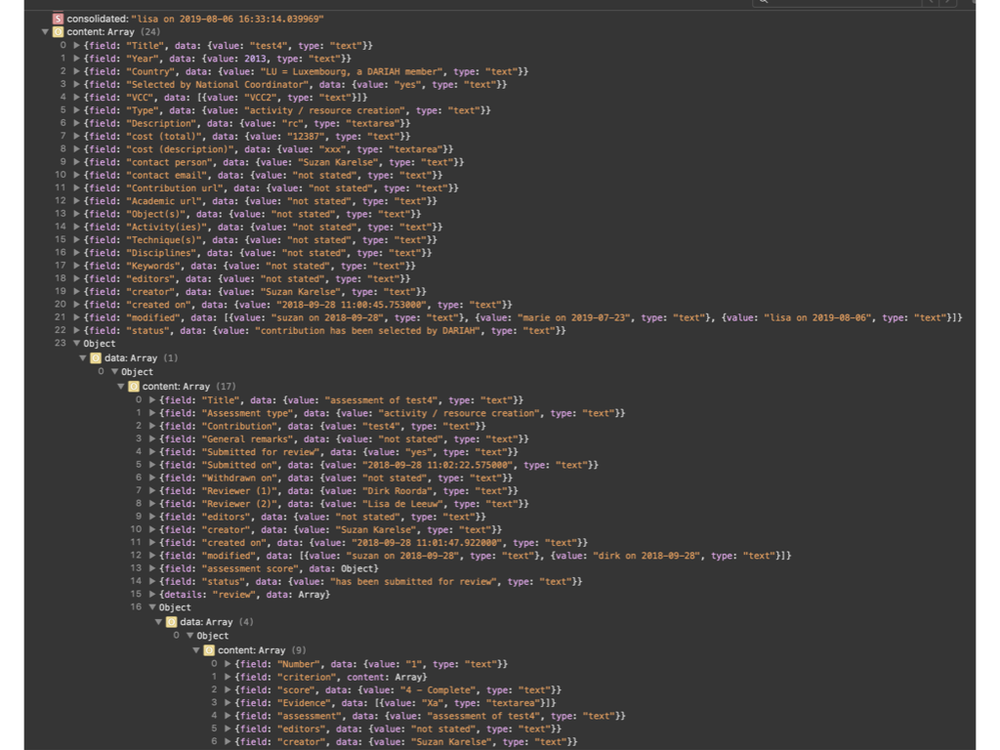

Here we document the functionality of the app from the perspective of the users
and stakeholders. We focus on the scenarios that are supported.

**N.B.:**

(✗) Items marked with a **single** ✗, are not implemented yet, but are expected
to make to the delivery on 2017-12-31.

(✗✗) Items marked with a **double** ✗, are not expected to be implemented before
the delivery on 2017-12-31. They may or may not be implemented in 2018.

Contributions
=============

A contribution is a piece of work in Digital Humanities, delivered by a person
or institute, and potentially relevant to the European DARIAH research
infrastructure. The national members of DARIAH may add such a contribution to
their agreed budget of in-kind contributions to DARIAH as a whole. This makes it
necessary to assess contributions against a set of well-defined criteria.

Assessment scenario
===================

Contributions may represent diverse efforts such as consultancy, workshops,
software development, and hosting services. This asks for a diversification of
contribution types and associated criteria. Moreover, types and criteria may
change over time, but during an assessment and review cycle they should be
fixed. The assessor of a contribution (from now on called *applicant*) needs to
state how that contribution scores for each relevant criterion, and for each
score, evidence must be given.

**typeContribution** is the table with the set of contribution types.

**criteria** is the table with the individual criteria, where each criteria can
be associated with one or more types.

**package** is the table of fixed constellations of types and criteria. At any
point in time there are one or more active packages, usually just one. A package
defines a set of contribution types, and a set of criteria. Every criterion is
linked to a number of contribution types, meaning that the criterion is relevant
to contributions of those types and no others. Every criterion is associated
with exactly one package, hence the package ultimately determines the mapping
between types and criteria.

A package has a validity interval, i.e. a start date and an end date. A package
is *active* at a point in time, if that point in time is inside the validity
interval. The types of an active package are the active types, and its criteria
are the active criteria. Technically, more than one package can be valid at the
same time. In that case, the sets of active types and criteria are the union of
the sets of types and criteria for each active package. But the intention is
that there is always exactly one active package.

Other components may call workflow functions in order to determine what the
active packages, types and criteria are, so they can render inactive and active
ones in different ways.

Assessing
---------

Applicants with write-access to a contribution can add a self-assessment to a
contribution. A self assessment is a record in the **assessment** table, and
consists of a few metadata fields.

When an assessment record is created, additional *detail records* will be
created as well. These are **criteriaEntry** records. For each assessment, there
is a fixed set of `criteriaEntry` records. This set is determined by the
currently active set of criteria: one `criteriaEntry` record will be created per
active criterion.

A `criteriaEntry` record has a field for choosing a **score** and a text field
for entering the evidence. Scores are defined in yet another type of record.

Scoring
-------

The scores for a criterion are entered in with the help of **score** records,
which are detail records of criteria. Scores have a number, typically `0`, `2`,
`4`, and a short description, typically `None`, `Partial`, `Full`, but the
number and nature of scores may vary freely between criteria.

The score of an assessment as a whole is the sum of the individual scores
expressed as percentage of the total amount of points that can be assigned. A
temporary overall score is obtained by treating unfilled scores as having value
`0`.

However, some criteria may allow scores with a value `-1` (non-applicable). If
an assessment assigns that score to a criterion, 0 points are added, but points
missed from this criterion will be subtracted from the total score, so that this
criterion will not be counted in the average.

*Example*: Suppose there are four criteria, A, B, C, D.

A, B, and C have scores `0`, `2`, and `4`.

D has scores `-1`, `0`, `2`, `4`.

Now there are two contributions U and V, with scores as follows:

Criterion | `contrib` U | `contrib` V
--------- | ----------- | -----------
A | 4 | 4
B | 4 | 4
C | 4 | 4
D | -1 | 0
sum | 12 | 12
total | 12 | 16
score | 100% | 75%

See how U does better than V although they have an equal number of points. But
for U criterion D does not count, while for V it counts, but the score is 0.

**N.B.** Not all criteria will allow `-1` values!

Review scenario
===============

After a contributor has filled out an assessment, (s)he can submit it for
review. The office will select two reviewers, and they will get access to the
self assessment.

Upon asking for review, the assessment and the contribution will be locked
temporarily.

The two reviewers have distinct roles:

*   **reviewer 1 (expert)** inspects the assessment closely and *advises* a
    decision;
*   **reviewer 2(final say)** *makes* the decision.

(✗✗) Both reviewers can enter comments in a comment stream, which are detail
records of the assessment.

The advice/decision that can be made by the reviewers is

*   **approve**
*   **reject**
*   **revise**

Consolidation
-------------

In all cases, a *consolidated* version of the reviews will be made. This records
contains the information of both of the reviews, the assessment and the
contribution. Consolidated means that all links to related records have been
replaced by the concrete values found in those records at that time.
Consolidated records do not contain fields that point to other records, only
concrete text/number/datetime values.

Currently, the consolidated version is stored in the database as a tree of
documents. All these documents are consolidated versions of documents that the
final review document refers to, directly or indirectly. Because the final
review refers to the self-assessment, and the self-assessment to both reviews,
the other review is also included in the tree.

The output below shows how this tree ends up in the client, on the application
state. It is shown by the console of the web page, in development mode. You can
see how this tree is a mini database of records and related records, hanging
together with simple identifiers of the form `"ddd"` where `d` is a digit.

It is not completely trivial to distil a nice, well-readable document out of
this. What we need is a consolidation *template*, that grabs the relevant data
from this mini-database. From that template, we can produce first HTML and then
PDF. Rather than a single template, we should make templates for each of the
tables involved.

(✗✗) Consolidated records will be stored as PDF and viewable from within the
app. What needs to be done here, is to write templates that select the desired
information from the tree of consolidated documents.

Approve
-------

A consolidated review-set will be stored in a collection called
`reviewConsolidated`. Apart from the consolidated materials of the reviews, the
assessment and the contribution, it contains the `_id` of the *live*
contribution, and a time stamp of the moment of consolidating.

The *live* assessment will remain immutable, but the *live* contribution becomes
mutable again.

So the consolidated review-set contains all information upon which the outcome
of the assessment is based, even if the live contribution undergoes subsequent
development.

The reason why contributions will not be permanently immutable is this:
contributions are likely to continue to evolve after assessment; their metadata
(among which URLs and email addresses) may change, and the contributor may wish
to keep the data for his/her contribution up to date, especially in view of data
exchange between the contribution tool and the Market Place.

Reject
------

A consolidated version of the review will be stored.

The *live* assessment will remain immutable, but the *live* contribution becomes
mutable again.

(✗✗) The applicant may enter an objection. In that case the back office will ask
a second opinion and take appropriate action, which might lead to a change of
decision, e.g. towards *revise*, or to a new review by other reviewers.

Revise
------

The *live* assessment and *live* contribution will become mutable again, and the
applicant can modify both in response to comments by the reviewers. When (s)he
is finished, the applicant can submit the modified version.

Trails
======

After an assessment and review process, the system contains a trail of all that
has gone on in the following form:

*   **live contribution** The contribution record is still in place, mutable, and
    contains only the actual situation
*   **live assessment** The assessment record is still in place, but immutable.
*   (✗✗) **live comments trail**
    *   (✗✗) by reviewers: comments and suggestions for modification
    *   (✗✗) by the applicant: to state an objection
*   (✗) **consolidated versions of assessments** There are snapshots of the
    assessment at pivotal points in time:

    *   (✗✗) when the assessment has been offered for review
    *   (✗✗) when reviewers have made decisions
    *   (✗✗) when second opinions have been asked and given

Management information
======================

The app compiles management information of a statistical nature, both to the
public and authenticated users. The quantity of information given is dependent
on user rights.

The public can see contributions, but not assessments and reviews, except the
ones that are finalized with outcome "accept".

(✗) In those cases, the assessment score is also visible.

Left-overs
==========

Email notification
------------------

It might be handy to send emails to users involved in assessing and reviewing to
notify them that a key event has occurred, such as the submission of an
assessment, the appointment of reviewers, the decisions by reviewers.

Push notification
-----------------

When an assessor calls up his/her assessment, and at the same time a reviewer
takes a decision, this fact is not pushed to the assessor's browsing session.
Only when the assessor feels like refreshing the page, (s)he will see the
effects of that decision.

We need some mechanism of hinting the user that important changes have been made
and a refresh is needed.

I know it can be done ( [socket]({{site.socket}}),
[python-socket]({{site.socketPython}}) ) but it requires a bit of research to
find the best way to do it.
