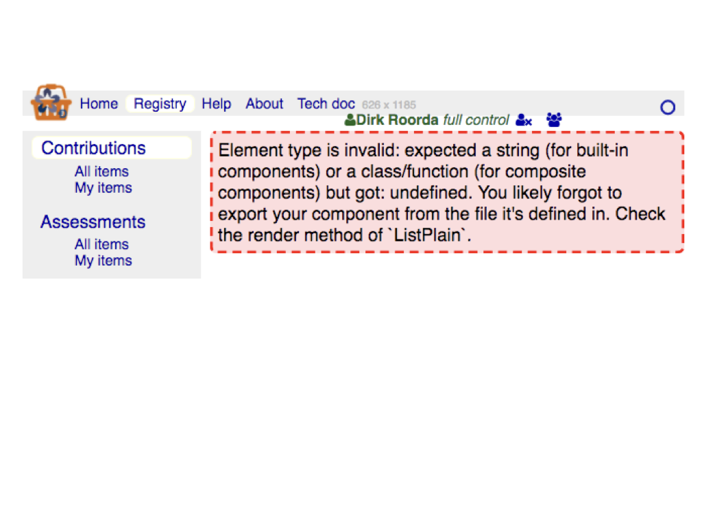
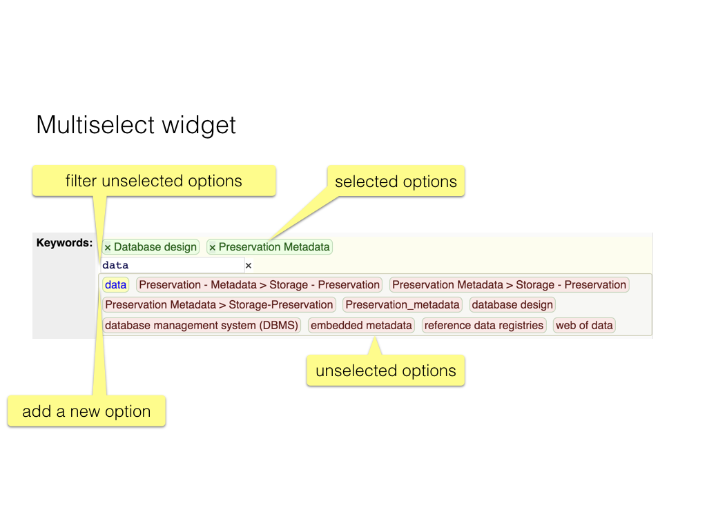

These are the [React](React) components, that make up the
part of the app that is visible in the browser.
They lean on the [dux](Dux) that work for them in the background.

Click on the names in the titles to view their source code on GitHub.

### Standard props

Components get *properties* as input (we call them *props*).
For each component we mention the props they expect and what type 
of data they represent.

However, some props occur over and over again, and we name them consistently.

Here is a list of those props and their types.
When we mention these props later on, we omit the types.

* `alter` **object**;
  a slice of the state from [getAltSection](Dux#getaltsection);
  Group of settings for components with alternative renderings:
  these settings tell which alternative has been chosen for each of those components;
* `alterSection` **string**;
  name of a section of the `alter` state; such a section contains the choice
  of alternative for a bunch of components that are relevant to the present
  component; each component that requests data from `alter` only gets data for a single
  section; in this way components will not be dependent on too big a part of the state;
  those dependencies may cause spurious re-renderings;
* `amounts` **object**;
  for a faceted filter: contains the amount of items that match each facet;
  see [computeFiltering](Dux#computefiltering);
* `children` **components**;
  a special prop defined by React itself;
  it contains the material that has been put in the component;
  you find it in the `render` function of the component;
  it is everything between `<Component>` and `</Component>`;
* `className` **string**;
  a class name to be put in the top level element of the rendered component;
* `compact` **bool**;
  whether the component should minimize the real estate on the screen that it uses;
* `detailFragments` **array of object**;
  the information on the basis of which the detail records of an item can be rendered;
  every entry in the array corresponds to a detail table that may contain detail records
  of the master record that is being dealt with;
  ultimately computed by [makeDetails](Lib#makedetails) and then passed to child components;
* `dispatch` **function**; this function belongs to the store that holds the state;
  it is generally injected into the props of a component by
  [connect](https://github.com/reactjs/react-redux/blob/master/docs/api.md#connectmapstatetoprops-mapdispatchtoprops-mergeprops-options)ing
  a component to the store; this only happens if `connect()` is called with
  zero or one argument (the `MapDispatchToProps` argument should be undefined);
  the `dispatch` function enables the component to trigger an action that changes the state;
  where you would call `setState()` in vanilla-React you put `dispatch(action)` if your
  app uses Redux;
* `eId` **string**;
  the MongoDB id of an entity that is being dealt with;
* `field` **string**;
  the name of a field that is being dealt with;
* `fieldFragments` **array**
  an array with instructions per field how to render it;
  ultimately computed by [makeFields](Lib#makefields) and then passed to child components;
* `filtered` **bool**;
  whether the list should be accompanied by filters;
  the specification of the filters themselves is in the
  [data model](Model);
* `fields` **objects**;
  defines a subset of all fields: these are the fields that the component has to deal with;
* `filteredAmount` **number**;
  the number of items that pass all filters;
  see [computeFiltering](Dux#computefiltering);
* `filteredAmountOthers` **object**;
  for each filter, the amount of items that passes all filters except that one filter;
  see [computeFiltering](Dux#computefiltering);
* `filterField` **string**;
  the name of the field that the current filter is acting upon;
  (as in the [data model](Model);
* `filterRelField` **string**;
  the name of the related field that the current filter is acting upon;
  this is relevant for fields that point to a related table: you can filter
  on the values of a specific field in the related table;
  (as in the [data model](Model);
* `filterId` **number**;
  the sequence number of a specific filter which identifies it among all filters
  for the same table;
* `filterLabel` **string**;
  the user-facing name of the filter;
* `filters` **object**;
  a slice of the state from [getFilters](Dux#getfilters);
  contains the actual filter settings, i.e.
  what the user has entered in search boxes and which facets the user has clicked;
  organized by table and then by `filterTag` and then by `filterId`; 
* `filterSettings` **object**;
  a slice of the state, sub-slice of `filters`, corresponding to the filters
  of a single `filterTag` of a single `table`;
* `filterSetting` **object** or **string**;
  a slice of the state, sub-slice of `filterSetting`, corresponding to a single filter,
  identified by `filterId`; whether this is an object or a string, depends on the nature
  of the filter: for a [Fulltext](#fulltext) filter it is a string (the search text), for a [ByValue](#byvalue) 
  filter it is an object, containing the status (boolean) of all its facet checkboxes;
* `filterTag` **string**;
  identifies a group of filters for a single table; tables may have multiple incarnations;
  a table can be a main table, but also a detail table for a specific record;
  the filters for a table when it displays details may be distinct from the filters
  of the same table when it is displayed as the main table; we separate those cases by 
  means of a `filterTag` prop;
* `linkField` **string**;
  when rendering a list of records that are details of some master record,
  this is the field of the detail records that holds the `masterId`; in this way the detail record
  links to its master record;
  when the component creates a new detail record, it will pre-fill this field with the current
  `masterId`;
* `listIds` **array of string**;
  a sequence of strings which are essentially MongoDB identifiers of entities in a table;
  components that display lists use this prop to determine which entities must be actually
  appear on the screen and in what order; see also the prop `filteredIds`;
* `masterId` **string**;
  when rendering a list of records that are details of some master record, this holds the MongoDB id of
  the master record;
* `me` **object**;
  a slice of the state from [getMe](Dux#getme);
  the information about the currently logged-in user, fetched from the server;
* `mode` **string**;
  either `list` or `grid`;
  whether the list of items should render as a list of expandable headings,
  or as a grid with full field information;
* `perm` **object**;
  Holds permissions for a record: whether deleting is allowed, and per field whether
  updating is allowed;
* `myValues` **object**;
  ultimately extracted from the `tables` slice of the state; it contains the values
  of the fields of the entity that is being dealt with;
* `select` **string**;
  sometimes a list is fetched as a whole, sometimes only *my own* records are displayed
  and yet other times only records that are the details of some master record must be shown;
  this property indicates which is which;
* `settings` **object**;
  a slice of the state from [getSettings](Dux#getsettings);
  settings are pieces of custom information that are relevant to many components of the app;
* `table` **string**;
  name of the table that the component must deal with;
* `submitValues` **function**;
  a callback that is used to save form values to the database;
  used for components that supply edit controls for form values:
  they can call `submitValues` after a change or upon loss of focus;
  it is basically the `handleSubmit` from Redux-From, with a specific
  first argument passed (`toDb`) that saves values to the database;
* `tables` **object**;
  a slice of the state from [getTables](Dux#gettables);
  all data that comes from database tables;
  organized by `table` name; for each table there is spec information
  and actual entity data;
* `win` **{**`width` **number**`, height` **number**`}`;
  a slice of the state from [getWinDim](Dux#getwindim);
  contains the physical dimensions of the window at any time.

[main]({{site.appBase}}/main.jsx)
=============================================================================================
connected via [roots](Dux#roots)

### Task
Entry point of the client side app.
Contains the [routing](Routing), wrapped in a [Root](#root) component, that
sets up the store in which the central state lives.

[App]({{site.appBase}}/components/App.jsx)
=============================================================================================
connected via [win](Dux#win)
#### [Props](#standard-props)
###### win children

### Task
As far as the logic of the web page is concerned, this is the top level component.

`App` is always in view and consists of the top navigation bar with

* logo, [Login](#login);
* [Notification](#notification));
* static links to documentation.

It is only used to display the height and the width somewhere on the screen.

[ByValue]({{site.appBase}}/components/ByValue.jsx)
=============================================================================================
connected via [filters](Dux#filters)
#### [Props](#standard-props)
###### alter alterSection tables table filterTag filterSetting filterId filterField filterRelField filterLabel  filteredAmount filteredAmountOthers listIds compact dispatch

###### `maxCols` number
The maximum number of columns in which the facets have to be stacked.

###### `expanded` bool
Whether the facets should be initially expanded or collapsed (hidden).

### Task
A widget by which the user can click the [facet](#facet)s associated with one field.
There is also a [collective checkbox](#checkboxi), by which the user can check or uncheck all facets in one go.
All values that occur are displayed, with statistics in the form *subtotal of total*.

[CheckboxI]({{site.appBase}}/components/CheckboxI.jsx)
=============================================================================================
(life cycle) connected via [filters](Dux#filters)
#### [Props](#standard-props)
###### table filterTag filterId filterSetting dispatch

### Task
Displays a *collective* checkbox for a [facet filter](#byvalue) with many facets.

Clicking on this box will collectively check and uncheck all associate
checkboxes.

The component invokes the method `handleCheck` upon clicking the checkbox.

This checkbox can have an indeterminate state, if some but not all
of the associate checkboxes are checked.

We have to resort to a [DOM](React#dom) manipulation after rendering to get the
indeterminate state across.

[Doc]({{site.appBase}}/components/Doc.jsx)
=============================================================================================
presents [docs](Dux#docs)
#### [Props](#standard-props)
###### `location` object
From this object the property `pathname` will be read, which will be split
into directory, file and extension parts.
The extension is used to switch to the component for that type of documents.

### Task
Handles the display of documents.
Depending on the type of document (markdown, html, pdf) it delegates work
to specialized document components: [DocMd](#docmd), [DocHtml](#dochtml) and
[DocPdf](#docpdf).

[DocHtml]({{site.appBase}}/components/DocHtml.jsx)
=============================================================================================
presents [docs](Dux#docs)
#### [Props](#standard-props)
###### `docDir`, `docName`, `docExt` string
The directory, filename and extension of the document container.

### Task
Displays an HTML document by linking to it in an IFRAME.

[DocMd]({{site.appBase}}/components/DocMd.jsx)
=============================================================================================
(life cycle) connected via [docs](Dux#docs)
#### [Props](#standard-props)
###### alter alterSection dispatch

###### `docName` string
The name of the document.

###### `text` string from [getDoc](Dux#getdoc)
The raw content of the document.

### Task
Show
[Markdown](https://guides.github.com/features/mastering-markdown/)
text, coming from files on the server.
The conversion to HTML is done client side,
and the user gets a control to switch between Markdown source and
formatted HTML.

A function `RouterLink` is defined to wrap local links into `Link` components
when transforming the markdown to html.
It makes it possible to write Markdown documents with
internal links to this application.

A full link (with protocol `http`(`s`) is translated to a
plain HTML `a` element, so clicking it will leave this application.

[DocPdf]({{site.appBase}}/components/DocPdf.jsx)
=============================================================================================
presents [docs](Dux#docs)
###### `docDir`, `docName`, `docExt` string
The directory, filename and extension of the document container.

### Task
Displays a PDF document by linking to it in an OBJECT.

**NB:** On iOS this does not work well, only the first page of the PDF gets shown,
we work around it by just displaying a link to open the PDF in a new tab.
We only do that when we detect an iOS browser.

[EditControl]({{site.appBase}}/components/EditControl.jsx)
=============================================================================================
A component that shows the current edit status of a record.
It is presented as a button that can be clicked to submit and save a form.
It can only be used as descendant of a [redux-form](https://redux-form.com)-enabled `<form>`-carrying
component. See also [EditStatus](#editstatus).

Uses the library function [editControl]({{site.libBase}}/edit.js).

[EditDelete]({{site.appBase}}/components/EditDelete.jsx)
=============================================================================================
Button to delete the record that is displayed with it.
The component is rather dumb, it needs to be passed an `onClick` handler that
will perform the delete action.

[EditHelp]({{site.appBase}}/components/EditHelp.jsx)
=============================================================================================
Information panel below input fields and markdown fields, telling
how to save and cancel, and showing the markdown constructs.

[EditInsert]({{site.appBase}}/components/EditInsert.jsx)
=============================================================================================
Button to insert a blank record into the currently displayed table.
The component is rather dumb, it needs to be passed an `onClick` handler that
will perform the insert action.

[EditStatus]({{site.appBase}}/components/EditStatus.jsx)
=============================================================================================
A component that shows the current edit status of a record.
It is presented as a `<span>` that looks exactly as an
[EditControl](#editcontrol), but it cannot be clicked to submit and save values.
It can be used everywhere, and it is itself enhanced by [redux-form](https://redux-form.com).
Because it is outside a `<form>` context, submitting will not work.

Uses the library function [editControl]({{site.libBase}}/edit.js).

[ErrorBoundary]({{site.appBase}}/components/ErrorBoundary.jsx)
=============================================================================================
Generic component, using new error handling functionality of React 16.
We use it to wrap components inside which errors may occur.
Those errors are then propagated to an enclosing `ErrorBoundary`, where they will be catched.
The console will log the error, and at the `ErrorBoundary` will be rendered
in place of its normal contents.

Currently we render the error boundary as a red block with a single diagnostic message.



[EUMap]({{site.appBase}}/components/EUMap.jsx)
=============================================================================================
(life cycle) connected via [filters](Dux#filters)
#### [Props](#standard-props)
###### alter alterSection tables table filterTag filterSetting filterId filterField filterLabel  listIds dispatch
(These are the same props as [ByValue](#byvalue))

### Task
A complex component!
It is a facet filter for the field *country*, using [ByValue](#byvalue) for that.
It also contains a map of Europe, visualizing by means of markers,
how the filter result is distributed over the DARIAH countries.

Both ingredients of this component are brought together not by
class extension but by including a `<ByValue/>` component in the rendering
of the `<EUMap/>` component.

The map is a [Leaflet](http://leafletjs.com) module on a blank pane,
with a [geojson]({{site.libBase}}/europe.geo.js) file of country boundaries laid out on it.
The map is not React-aware, it will be rendered in its own `<div/>`.
The [life cycle](React#life-cycle) methods of this component set up the map and update when new filter settings have been applied.

### Compute Marker Radius

When we know the filter results per country, we can put markers on them
with a radius in proportion to their scores.
However, if the scores are very far apart, either the small markers get invisible,
or the big markers get too big.
We mitigate this effect, by using proportional radii only for values below a certain
threshold (`LEVEL_OFF`). For higher values we essentially take the square root.

[Facet]({{site.appBase}}/components/Facet.jsx)
=============================================================================================
connected via [filters](Dux#filters)
#### [Props](#standard-props)
###### table filterTag filterId filterSetting className dispatch

###### `valueId` string
The id of the value that is associated to this facet.

###### `valueRep` string
The string representation of the value that is associated to this facet.

### Task
Displays a single facet. Just a checkbox and a value representation.

Note that we use the strategy of [controlled components](React#controlled-component) here.

[FieldEdit]({{site.appBase}}/components/FieldEdit.jsx)
=============================================================================================
connected via [tables](Dux#tables)
#### [Props](#standard-props)
###### alter tables table eId field dispatch submitValues

###### `allowed` object
An array of entity ids that are the allowed elements when the field is a multiple
choice field.

###### `...props` any
There are many more props that get passed to `FieldEdit`. 
They have been injected by the wrapper
[redux-form()](http://redux-form.com/{{site.reduxFormV}}/docs/api/ReduxForm.md/) into
[ItemForm](#itemform), the parent of this component, and they will be passed
on to *Field* and *FieldArray*, so that they can do their magic.

### Task
Edit control for an editable field.
Depending on the type of the field and the multiplicity, it presents
the right control.
Basically, this component produces one or more 
[Field](http://redux-form.com/{{site.reduxFormV}}/docs/api/Field.md/) 
or
[FieldArray](http://redux-form.com/{{site.reduxFormV}}/docs/api/FieldArray.md/)
components (which are provided by [redux-form](https://redux-form.com). 

Note that we do not pass the actual values to these components.
They know how to get the current values from the state, and what actions
must be dispatched to change them.

However, both `<Field />` and `<FieldArray />` still do not actually present
the edit control. They only do the plumbing.

For the actual presentation, you can plug in a component of choice.
We will use `<input type="..." />`, `<textarea>...</textarea>` elements and
our own custom component [RelSelect](#relselect) for multi-select controls.

We enhance *textareas* by offering markdown previews of their content.
See [MarkdownArea](#markdownarea).

We wrap multiple *input*s in [InputMulti](#inputmulti) and single inputs
in [Input](#input).
The extra level of wrapping of these presentational components is needed
for showing validation errors.

#### Note on the prop `allowed`
In most cases a multiple choice is between members of a value list or related table, but
sometimes we want to restrict the set of choices further, especially when we 
are offering a choice in a detail record.
Then the master record might contain information that constrains the option for some fields
in the detail records.

For example, the `criteriaEntry` record contains a multiple choice field
to choose between a bunch of scores.
However, not all scores of the `score` table are valid choices, only those scores that
belong to the `criteria` record referred by the `criteriaEntry` record.

#### Caution
In order to get everything working correctly, two problems had to be solved.
Both turned out to be related to Redux-Form.

* The component that you pass to the `component` prop of `Field` and `FieldArray`
  must not be dynamically composed in the `render()` function that produces `Field(Array)`.
  Because in that case, the `Field(Array)` is re-rendered too often,
  and effect for the user is that he loses focus after entering the first character, which is 
  *very* annoying.

  So, the value for `component` must be a static function. 
  But what if this function needs dynamically determined arguments?
  How can they be passed to it?
  The solution is simple: pass them as props to `Field(Array)`, and they will be passed
  on to the component function by redux-form.

  This is actually documented in the redux-form docs. You need 
  [this](http://redux-form.com/{{site.reduxFormV}}/docs/api/Field.md/),
  section **2. A stateless function**

  > You must define the stateless function outside of your render() method,
  or else it will be recreated on every render and will force the Field to re-render
  because its component prop will be different.
  If you are defining your stateless function inside of render(),
  it will not only be slower, but your input will lose focus
  whenever the entire form component re-renders.

  and
  
  [this](http://redux-form.com/{{site.reduxFormV}}/docs/api/Field.md/#props):

  > Any custom props passed to Field will be merged into the props object
  on the same level as the input and meta objects.

* When navigating between forms for several records, the `onChange` callback,
  that should be bound to the proper form, becomes bound to the wrong form.
  As far as I can see, all other things work as expected, so it was difficult to see
  why this occurred. The explanation is in a 
  [GitHub issue](https://github.com/erikras/redux-form/issues/2886).
  Summarized: the construction of the `onChange` function is effectively memoized.
  It is determined upon mounting of the component, but not on updating it.
  The workaround is easy: add an extra key property to the form.
  Another cause for the same problem I encountered in [InputMulti](#inputmulti),
  where I had memoized the callbacks for adding and removing values to/from a sequence.

[FieldRead]({{site.appBase}}/components/FieldRead.jsx)
=============================================================================================
connected via [tables](Dux#tables)
#### [Props](#standard-props)
###### settings tables table myValues field

### Task
Presents the value(s) of a read-only field, based on *initial values*.
Note that value of type `textarea` will be rendered as formatted markdown.

[FieldSet]({{site.appBase}}/components/FieldSet.jsx)
=============================================================================================
presents [tables](Dux#tables)
#### [Props](#standard-props)
###### submitValues
###### `input` object
Contains the attribute `onChange` by which the form value of this field can be changed.

###### `widget` function
A function that when passed a handler, will return a React fragment.
When this fragment receives a click, the event handler will be called.

###### `setValue` any value
The value that will be passed to the handler of `widget`, when it receives a click.

### Task
This is a form input component meant to be passed to a 
[Field](http://redux-form.com/{{site.reduxFormV}}/docs/api/Field.md/) component,
like [Input](#input).
But unlike an `Input`, it only handles a click event, upon which it will change
the value in the field to `setValue`, and save the form to the database.


[Filter]({{site.appBase}}/components/Filter.jsx)
=============================================================================================
connected via [filters](Dux#filters)
#### [Props](#standard-props)
###### tables table listIds filters filterTag filteredAmount filteredAmountOthers amounts compact

### Task
A control to filter a list of items.
The following types of filters are implemented.
* [Fulltext](#fulltext): Search in a textual field for a pattern.
  The pattern is entered by the user,
  the search is incremental, after each keystroke the results are updated.
* [ByValue](#byvalue): Faceted search for values of a specific field.
  * [EUMap](#eumap): Faceted search on country, together with a map visualization

The list of the available filter types and their characteristics are not
configured on the client, but come from the server.

This generic component merely calls the specialized filter components
with the right props for each filter associated with a table.
Whereas the incoming props contain information for all filters,
each individual specialized filter is passed only the slice that is relevant to 
that one filter.

[Fulltext]({{site.appBase}}/components/Fulltext.jsx)
=============================================================================================
connected via [filters](Dux#filters)
#### [Props](#standard-props)
###### table filterTag filterId filterLabel filterSetting filteredAmount filteredAmountOthers compact dispatch

### Task
Displays a full text search input field.
The characters entered in this field are passed upwards by means of a callback.
This is incremental search.
Not only the full text search, but also all other filters are computed upon each character entered.

Note that we use the strategy of [controlled components](React#controlled-component) here.

[Input]({{site.appBase}}/components/Input.jsx)
=============================================================================================
presents [tables](Dux#tables)
#### [Props](#standard-props)
###### submitValues
###### `meta` object
Contains attributes related to validation and edit state; is the value changed and unsaved,
invalid, and of so, for what reason?

###### `input` object
Contains attributes related to the actual value that is being held.
These attributes are passed verbatim to the underlying `<input />`.

###### `type` string
The *type* of `<input type="..." />`. It will go to the place of the dots.

### Task
Shows an `<input type="..." />` control, and shows validation errors if the value entered
by the user does not validate.

It is a [controlled component](React#controlled-component).

[InputMulti]({{site.appBase}}/components/InputMulti.jsx)
=============================================================================================
presents [tables](Dux#tables)
#### [Props](#standard-props)
###### submitValues
###### table eId fields

###### `componentSingle` function
The edit component that has to be rendered multiple times.

###### `validateSingle` function
Validation function. Takes a value and return undefined if all is well, and otherwise a reason why not.

###### `normalizeSingle` function
Transforms the entered value into a normalized value for saving.

###### `fields` array
The names of the individual fields.
If the collective name of this field is `foo`, than this array contains
`foo[0]`, `foo[1]`, etc., as many as their are values. These names are just strings.

###### `meta` object
Contains attributes related to validation and edit state; is the value changed and unsaved,
invalid, and of so, for what reason?

###### `...props` any
There are many more props that must be passed to `Field`. 
They have been injected by the wrapper
[reduxForm()](http://redux-form.com/{{site.reduxFormV}}/docs/api/ReduxForm.md/) into
[ItemForm](#itemform), the uncle (`InputMulti` is passed as attribute to `Field` which is
a child of [FieldEdit](#fieldedit)) of this component, and they are just passed
on to *Field* and *FieldArray*, so that they can do their magic.

### Task
Renders a sequence of
[Field](http://redux-form.com/{{site.reduxFormV}}/docs/api/Field.md/) 
components on behalf of a
[FieldArray](http://redux-form.com/{{site.reduxFormV}}/docs/api/FieldArray.md/)
component.
There are controls to remove values, and to add fresh, empty values.

Validation and normalization are done per individual *Field*.

It is a [controlled component](React#controlled-component).

[ItemAction]({{site.appBase}}/components/ItemAction.jsx)
=============================================================================================
connected via [tables](Dux#tables)
#### [Props](#standard-props)
###### settings tables table eId linkField fieldFragments dispatch

These are all the properties that `ItemForm` gets from its parent and from its connection with the
state.
But we wrap `ItemForm` in `reduxForm()` and this will inject a number of other properties
into it.
We list the few that we visibly use.
There are more injected properties, and these we pass carefully
on to other components.

###### `handleSubmit` function
A function that is invoked when the form is submitted.
This function is passed from [redux-form](https://redux-form.com) and handles all
the form submission machinery.
See [ItemEdit](#itemedit).

### Task
Manages the display of a single record, but only as far as an [ActionTemplate](#templates)
has been provided for that table.
The action template may contain controls that modify fields and save them to the database,
exactly as [ItemEdit](#itemedit).

The component does not show *save* and *reset* buttons.
It is meant for controls that save changed values on their own.

This component is meant for stuff that needs to be present both in read-only view
and in edit-view.

### Using templates
This component uses
[applyEditTemplate](Lib#applyedittemplate)
to see whether there is an action template defined in
[Templates](#templates).
If yes, that template will be applied, if no, nothing will be rendered.

[ItemContainer]({{site.appBase}}/components/ItemContainer.jsx)
=============================================================================================
(life cycle) connected via [tables](Dux#tables)
#### [Props](#standard-props)
###### settings tables table eId filters dispatch

### Task
Container for a single record in a table.
This component is responsible for fetching the item data from the database (if needed),
but not form input.

[ItemDetails]({{site.appBase}}/components/ItemDetails.jsx)
=============================================================================================
connected via [tables](Dux#tables)
#### [Props](#standard-props)
###### alter alterSection tables table eId filters detailFragments dispatch

### Task
Presents a list of detail items of a master record.

[ItemEdit]({{site.appBase}}/components/ItemEdit.jsx)
=============================================================================================
connected via [tables](Dux#tables)
#### [Props](#standard-props)
###### tables table eId fieldFragments dispatch

###### `nextAlt` function
This function can be used to switch this component from read-only view to edit view
and back. 
It will be passed on to the widget that also has the edit controls for
submitting and resetting the form.

These are all the properties that `ItemForm` gets from its parent and from its connection with the
state.
But we wrap `ItemForm` in `reduxForm()` and this will inject a number of other properties
into it.
We list the few that we visibly use.
There are more injected properties, and these we pass carefully
on to other components.

###### `dirty` boolean
Whether the form contains changed, unsaved values in any of its fields.

###### `invalid` boolean
Whether the form contains invalid, values in any of its fields.
The form uses two kinds of validation:

* synchronous: on every keystroke, the current value will be subjected to a validation function
* on submit: the submitted values will be validated on the server, and if that fails, the reasons
  for failure will be reported in exactly the same way as for synchronous validation.

###### `error` object
Object that contains the reasons for validation errors.

###### `submitting` boolean
Whether a submit action of the form is pending. 

###### `reset` boolean
A function that can reset the form.
Resetting means: changing all edited values back to the initialValues.

###### `handleSubmit` function
A function that is invoked when the form is submitted.
This function is passed from [redux-form](https://redux-form.com) and handles all
the form submission machinery.
It also calls a function that you can pass to it as first argument.
We pass it our `toDb(table, eId, mod)` function.
This is a function that takes a `values` object, and calls `mod(table, eId, values)`,
where `mod` is the function that dispatches a server action: the `values` are sent
to the server, where they are used to update the record `eId` in `table`.  

### Task
Manages the display and editing of a single record.
It is only used if there are editable field.
If that is not the case, [ItemRead](#itemread) is being used.
We do this to avoid to invoke the costly machinery of editable forms when it is not needed.

The component also shows [save](EditControl) and [reset](EditControl) buttons (if appropriate).

The component has two render modes: read-only view and edit-view.
When a user has edited the form, he can switch to the read only view to see the result.
In read-only view, markdown fields are rendered as formatted text, and tags in select controls
do not open the choice when you click on it. 
Instead such a click takes to an item view of that value in its own table.

We use [redux-form](http://redux-form.com) for displaying forms,
filling them out, submitting them, sending the values to the database,
validating and normalizing
values.

Although *redux-form* has an awesome functionality, it is far from trivial to get it integrated.

The work horses are the
[Field](http://redux-form.com/{{site.reduxFormV}}/docs/api/Field.md/) 
and
[FieldArray](http://redux-form.com/{{site.reduxFormV}}/docs/api/FieldArray.md/)
components.

These elements can be put in an arbitrary component, under a `<form/>` element.
The resulting component is enhanced by the
[reduxForm()](http://redux-form.com/{{site.reduxFormV}}/docs/api/ReduxForm.md/) function.

The basic flow is this:

* we read the values of a record from the state and pass them to the redux-form component as *initial values*;
* *redux-form* manages its own slice of the state (`form`) and has its own set of actions to respond
  to user interactions;
* when the user interacts with the form, the work ends up in the `form` slice of the state;
* when the form is *submitted*:
  * the current values are sent to the database, and the updated record is read back from the database;
  * the updated values are passed to the form as new initial values
  * the form re-initializes itself, and the user can start again;
* when the user interrupts editing the form, and switches to another component, nothing is lost:
  * the edits are saved in the state;
  * when the form is mounted again, not only the initial values are fetched back, but also
    the edit state is restored;
* submitting happens with *auto save*: whenever an input field looses focus, the form is submitted;
  submitting happens also for those fields in which you can not have a cursor: whenever a field
  value is changed by a click, the form is submitted.

Hence it is easy to edit two forms at the same time, which can be handy if (s)he edits two
contributions that need to have a consistent wording.
It is also possible to edit the same records in multiple components on the interface.
Both refer to the same underlying state.

### Implementation
The construction of the actual fields is done by a function `makeFields()`, that
generates an array of fragments, one for each field.
An editable field will be handled by a
[`<FieldEdit />](#fieldedit) component,
and a read-only field by a
[`<FieldRead />](#fieldread) component.

### Using templates
Before setting up the fields of an item,
[applyEditTemplate](presentation#applyedittemplate)
is called.
If it finds a suitable template in [Templates](#templates)
it will be applied.
If not, all fields will be displayed in a generic presentation.

[ItemForm]({{site.appBase}}/components/ItemForm.jsx)
=============================================================================================
connected via [tables](Dux#tables)
#### [Props](#standard-props)
###### alter alterSection tables table eId filters fields perm fieldFragments detailFragments dispatch

###### `initialValues` object
An object with the initial values of all fields that are being managed by the form as a whole.

###### `isactive` string
A CSS class name to add extra formatting if the record in question is deemed *inactive*.
The notion of active items is defined in the duct [workflow](Dux#workflow).

### Task
This is the component that can open an item and show its fields, either for reading or
for editing. 
Every list rendering component that want to display an individual item full view,
will use this component.
Full view means: as a vertical table of field labels and field values.

[ItemRead]({{site.appBase}}/components/ItemRead.jsx)
=============================================================================================
connected via [tables](Dux#tables)
#### [Props](#standard-props)
###### tables eId fieldFragments

### Task
Manages the display (read-only) of a single record.
It is used if no fields need to be edited.
For editing records, [ItemEdit](#itemedit) is being used.

You might wonder why `table` is missing in the props.
The `fieldFragment`s prop contains that information.

Before setting up the fields of an item,
[applyTemplate](presentation#applytemplate)
is called.
If it finds a suitable template in [Templates](#templates)
it will be applied.
If not, all fields will be displayed in a generic presentation.

[ItemRow]({{site.appBase}}/components/ItemRow.jsx)
=============================================================================================
connected via [tables](Dux#tables)
#### [Props](#standard-props)
###### tables table eId fields perm filters widthStyles

###### `initialValues` object
An object with the initial values of all fields that are being managed by the form as a whole.

###### `widthStyles` object
Since this component has to render records in a grid view, it must know something about
the widths of the columns.
That information is contained in this prop, as a CSS style per column.

###### `alt` bool
The component must know whether it is an ordinary grid row, or whether the fields should
be expanded into a vertical form.

###### `nextAlt` function
This function can be used by a control by which the user can switch between row view and vertical
view of the record.

###### `isactive` string
A CSS class name to add extra formatting if the record in question is deemed *inactive*.
The notion of active items is defined in the duct [workflow](Dux#workflow).

### Task
This component displays a record in row form, so that it fits in a grid view of the
whole table. See [ListGrid](#listgrid).

[ListContainer]({{site.appBase}}/components/ListContainer.jsx)
=============================================================================================
(life cycle) connected via [tables](Dux#tables)
#### [Props](#standard-props)
###### tables table eId select mode filtered dispatch

### Task
Manages a table. Responsible for fetching data from the server.
The display of the (filtered) table is left to other components,
such as [ListFilter](#listfilter).

It can be instructed to navigate to a specific item.
This is used when the id of the item to navigate to is contained in the URL.

The `eId` prop is the one that contains the item to navigate to.

[ListFilter]({{site.appBase}}/components/ListFilter.jsx)
=============================================================================================
(life cycle) connected via [filters](Dux#filters)
#### [Props](#standard-props)
###### `filteredAmount` object, `filteredAmountOthers` object, `amounts` object from [getFiltersApplied](Dux#getfiltersapplied)
The results of [applying](Dux#getfiltersapplied) the filters.

###### `initialized` bool
Whether the filters have been initialized.

###### `init` function is [setupFiltering](Dux#setupfiltering)
Callback to initialize filtering.

### Task
Parent component of a table and all its filters.
The table must be present.
Fetching tables is done by other components, such as
[ListContainer](#listcontainer).
This component is for processing user interaction on the filters.
The filters and the list of filtered items are shown in separate
[Pane](#pane)s.

[ListGrid]({{site.appBase}}/components/ListGrid.jsx)
=============================================================================================
connected via [tables](Dux#tables)
#### [Props](#standard-props)
###### alter alterSection settings tables table listIds select filters perm masterId linkField dispatch
###### `grid` object
Slice of the state, obtained with [getGrid](Dux#getgrid), which holds sorting information
of table grids.

###### `gridTag` string
Key under which the component finds its information about which columns are sorted in what order
and direction.

### Task
This component shows a table as a grid.
It uses [CSS flex-box](https://CSS-tricks.com/snippets/CSS/a-guide-to-flexbox/)
for the grid layout. 
There is also [CSS grid](https://CSS-tricks.com/snippets/CSS/complete-guide-grid/)
but at the time of writing this app, browser support for grid was substantially inferior to
browser support for flex.

The grid can be sorted by column, in ascending and descending order.
You can sort on one column first and then on another and so on.

Every grid remembers its sorting state in the grid slice of the state, where it is 
available under a key.

[ListPlain]({{site.appBase}}/components/ListPlain.jsx)
=============================================================================================
(life cycle) connected via [filters](Dux#filters)
#### [Props](#standard-props)
###### alter alterSection tables table listIds select filters perm masterId linkField dispatch
###### `navItem` string
The item to navigate to, by its MongoDB id.
It will be opened and scrolled into view.

### Task
Displays a list of items from a table.
Every items is represented as a heading, usually consisting of the title field of 
the item. 
If the user has permission to see more, there is a control on each item to expand
the heading into the fields and values of the item.
If the user has edit permissions, he can edit the item from here.

If the user inserts a new item, the component will navigate to that item.

[Login]({{site.appBase}}/components/Login.jsx)
=============================================================================================
(life cycle) connected via [me](Dux#me)
#### [Props](#standard-props)
###### me dispatch

### Task
The main task of Login is to fetch the current authentication status:
is there an authenticated user, and if so, what is his/her name?

[MarkdownArea]({{site.appBase}}/components/MarkdownArea.jsx)
=============================================================================================
connected via [tables](Dux#tables)
#### [Props](#standard-props)
###### alter alterSection table eId dispatch submitValues
###### `meta` object
Contains attributes related to validation and edit state; is the value changed and unsaved,
invalid, and of so, for what reason?

###### `input` object
Contains attributes related to the actual value that is being held.
These attributes are passed verbatim to the underlying `<input />`.

### Task
An edit control for bigger chunks of text.
It is basically a `<textarea>...</textarea>` but it is enhanced to convert to the text
to markdown and to display a formatted preview of the text.
What is saved to the database is the raw markdown. 
The formatted text is ephemeral, its only function is for the pleasure of the user.
Note that in read-only view these values will be also rendered as formatted text.

[NavLink]({{site.appBase}}/components/NavLink.jsx)
=============================================================================================
presents __none__
#### [Props](#standard-props)
###### activeClassName
The CSS class to be used when the navigation link has been clicked.

###### `...props` any
All other props are passed to the wrapped `<Link/>` component.

### Task
Displays a navigation link that is sensitive to routing.
That means: it is a link that can activate a component, and, when clicked,
it will become highlighted.

[NotFound]({{site.appBase}}/components/NotFound.jsx)
=============================================================================================
presents __none__
#### [Props](#standard-props)
###### `splat` string
The text to display on the 404 page.

### Task
Displays a 404 if no
[route](React#routing) in [main](#main) matches.

[Notification]({{site.appBase}}/components/Notification.jsx)
=============================================================================================
(life cycle) connected via [notes](Dux#notes)
#### [Props](#standard-props)
###### dispatch
The following properties are injected from the state by [getNotes](Dux#getnotes):

###### `messages` array of objects
The list of notifications that have been issued since the beginning of the session or since the last time that the user has cleared the messages.

###### `busy`
The amount of asynchronous actions that are still pending.

###### `show`
Whether the panel should be hidden. 

###### `lastMsg`, `lastNote`, `lastKind`
The indexes of the last message and the last notable message, and the kind of the last notable message, which is one of `error`, `warning`, `special`.
Only the kind `info` is non-special.

When the notifications are displayed, the panel will be scrolled to the last notable message if there is one,
otherwise to the last message.

### Task
Component that receives notifications and displays them in a
little panel with fixed position on the screen.
The panel is hidden by default and pops up if there is an important notification.
The user can click it away and also clear the notifications.

There is also a progress indicator, a little circle fixed at the top right corner of the screen.
It hints at the current status of asynchronous operations. A click on it will show the notifications panel.

[OpenCloseAll]({{site.appBase}}/components/OpenCloseAll.jsx)
=============================================================================================
A control by which you can close all currently open records in a list.
If the list is a detail records list, there is also a control to *open* all items
in the list.
But in general, a complete list cannot massively be opened in this way.

The real work is done by the functions
`handleOpenAll`, `handleCloseAll` in [tables]({{site.appBase}}/dux/tables.jsx).

[Overview]({{site.appBase}}/components/Overview.jsx)
=============================================================================================
Under construction.
Meant to become a customized dashboard for the back office functions.

[RelSelect]({{site.appBase}}/components/RelSelect.jsx)
=============================================================================================
presents [select](Dux#select)
#### [Props](#standard-props)
###### settings tables table select field dispatch submitValues

### `multiple` bool
Whether to display a select widget where the user can make multi-selections or only
single selections.

### `allowNew` bool
Whether to allow the user to add new options.

### `selectTag` string
A key under which this component stores its data on the `select` slice of the
global state. This is about whether the options have popped up and what
search text the user has entered in the filter box.

### `activeItems` array
The notion of active items is defined in the duct [workflow](Dux#workflow).

###### `isactive` string
A CSS class name to add extra formatting if the record in question is deemed *inactive*.

###### `allowed` object
An array of entity ids that are the allowed elements when the field is a multiple
choice field.

###### `input` object
Contains attributes related to the actual value that is being held.
These attributes are passed verbatim to the underlying `<input />`.



### Task
An implementation of multi-select widgets. 
There is a fairly complete [react-select](https://github.com/JedWatson/react-select) component on GitHub.
However, it has some flaws that prevents a successful usage of it in our app.
That is why I have written this component.

The capabilities of this widget are:

* single select or multi-select, depending on the property `multiple`;
* fixed list of values or the possibility to create new values on the fly, depending on the prop `allowNew`;
* options can be filtered by a full text filter;
* only one copy of an option can be chosen;
* selected options are removed from the list of selectable options;
* plays well with [Redux-Form](https://redux-form.com);
* facilitates disabling some options and presenting options in custom ways

[Root]({{site.appBase}}/components/Root.jsx)
=============================================================================================
presents [roots](Dux#roots)
#### [Props](#standard-props)
###### children

### Task
Top-level wrapping component to set up the central store. It does so
by configuring the store, calling [configureStore](Dux#configurestore), and passing
it to the special [Provider](React#redux) component of Redux.

Then it wraps the whole remaining app in a [Window](#window) component for 
detecting some global UI events.

[Stat]({{site.appBase}}/components/Stat.jsx)
=============================================================================================
presents [filters](Dux#filters)
#### [Props](#standard-props)
###### className
###### `subtotal`, `total` number

### Task
Displays a string of the form *subTotal* `of` *total*.
If one of the two is missing, the `of` will not display.

[Static]({{site.appBase}}/components/Static.jsx)
=============================================================================================
presents __none__
#### [Props](#standard-props)
None.

### Task
Displays navigation links to some static resources.

[SubApp]({{site.appBase}}/components/SubApp.jsx)
=============================================================================================
presents [win](Dux#win)
#### [Props](#standard-props)
###### me table children

###### `routes` components
These are object passed by
[React-Router](https://github.com/ReactTraining/react-router/tree/v3/docs).
From this the navigation route that the user has followed to arrive here, can be read.

### Task
This is one of the components just below [App](#app).
It contains a set of panes and navigation links to main subcomponents to
display in those panes.
Most of those subcomponents are linked to a main table, which is passed in the `table` prop.

[Templates]({{site.appBase}}/components/Templates.jsx)
=============================================================================================
For some parts of the application the generic ways of presenting records and fields
is just not good enough, e.g. for the display of assessments.
We need a deeper customization there, where the criteriaEntry detail records should
appear in one big form.

The challenge is to use as much of the generic machinery when we define custom presentations.
Our solution here is by using *templates*.

Looking up a field value might seem a very innocent operation: you retrieve the
appropriate document from the database, look up the field in question, and read out the value 
that you find there.
Alas, there are several complicating factors:
* That value might be a MongoDB object identifier pointing to a related record.
  We do not want to display that identifier, but the corresponding record, but not
  the whole record. Only an informative heading. For that we have to look up additional
  fields in the related table, and possibly apply logic depending on what we encounter.
* We should not show fields that the current user is not entitled to view.
  We should not put in edit controls for fields that the current user is not allowed to 
  edit.

These concerns are built into the generic logic, in the components
* [ItemRead](#itemread)
* [ItemEdit](#itemedit)
* [FieldRead](#fieldread)
* [FieldEdit](#fieldedit)
and we do not want to reimplement this logic when we do templates.

Our solution is that templates are not static strings into which 
field values are merged dynamically.

Instead, our templates are *functions* that take a properties object as arguments.
The properties are functions that can furnish representations for fields.
These functions use the general machinery to
* compute string values for fields;
* compute read-only values for fields including looking up headings of related records,
  for fields pointing to them, and wrap them in
  [FieldRead](#fieldread) components;
* present appropriate edit controls for fields whenever the user may change their values
  and wrap them in
  [FieldEdit](#fieldedit) components.
* present custom controls for fields upon click events
  and wrap them in
  [FieldSet](#fieldset) components.

Applying a template means feeding a higher order React component with
a properties object of field rendering functions, which results in 
a concrete React component.

The templates will be applied by
[ItemRead](#itemread),
[ItemEdit](#itemedit),
and
[ItemAction](#itemaction),
.
using the functions
[applyTemplate](presentation#applytemplate)
and
[applyEditTemplate](presentation#applyedittemplate)

### Task
There are several situations that ask for templates:
* related records (read only)
* detail records (read only)
* detail records (editable)
* consolidated records

In all those cases the templates are organized in objects, that are first keyed
by the name of a main table.
For each main table there is an object of functions, the template functions, named
after the related/detail table they are for.

#### Explanation
**Related records** are records pointed to by a field in a main record.
For example, a `assessment` record has a field `contribution`, containing the
identifier of the contribution record that the assessment is targeting.
Here the assessment record wants to display a contribution record as read-only information.
A template for this can be defined as follows:  

```jsx
const relatedTemplates = {
  contrib: {
    assessment({ v, e, f, linkMe }) {
      const cTitle = v('title')
      return (
        <div>
        presentation of fields, using v, e, f
        </div>
      )
    },
    ...
  },
  ...
```

**Detail records** are records that point to another record.
For an example, an `assessment` record is accompanied by a series of 
`criteriaEntry` records. The `assessment` record has no pointers to the `criteriaEntry`
records. Rather each `criteriaEntry` record points to an assessment record.

If record A points to record B, you could say that record B is as master record and A is a detail of it.
But in our application, this is not automatically so.

For example, a contribution points to a `year` record, to indicate the year of the contribution.
Yet we do not consider a contribution to be a detail of a year.

If you want related records to be treated as detail records, you have to say so in the
[data model](Model).

**Readonly** versus **Edit** versus **Action**
For main and detail records, we have several sets of templates;
* **Read** for presentation of records in read-only mode,
* **Edit** for presenting records as forms with editable fields,
* **Action** for presenting actions upon records.

The idea is that the form can switch between **Read** and **Edit** by means of a standard
control, and that the **Action** part is independent of that switch: it is always displayed.

In the **Read** part, you cannot have edit controls, but in the **Edit** and **Action** parts
you can have them.
However, in the **Action** part, you do not have `save` and `reset` buttons.
This part is meant for action buttons, which change a field to a predefined value and save
them immediately.

**Consolidated records** are records for which all related values and relevant details have been 
collected and represented as strings. 
A consolidated record is a frozen snapshot of the logical content of a record.
It will not change if related records and detail records are modified.
We use consolidated records for storing contribution metadata in assessment records when
the assessment has finished, and other cases where we have to preserve a record of activities.

### Applying templates
A template is a function that can be passed a `props` object containing functions that deliver
field value information:
* `v = field => ` *read-only string value for* `field`
* `f = field => <FieldRead> ` *react component for reading* `field`
* `fe = field => <FieldEdit> ` *react component for editing* `field`
* `fs = field => <FieldSet> ` *customizable react component for setting* `field`
  to a predefined value
* `e = field => ` *whether that field has an empty value*
* `m = field => ` *whether that field is editable by the current user*

### mainTemplates
Object, keyed by the names of tables.
The values are *read* templates for records in those (main) tables.

These templates are not passed the `fe` function.

### mainActionTemplates
Like *mainTemplates*, but now the values are *action* templates.

These template functions are passed the `fe` function.

### mainEditTemplates
Like *mainTemplates*, but now the values are *edit* templates.

These template functions are passed the `fe` function.
There is an extra parameter `editButton`, which is a React component that 
holds the [edit/save button](EditCOntrol) for this record.

### detailTemplates
Object, keyed by the names of the detail tables and then by the names of master tables.
The values are *read* templates for records in those detail tables, when they
are presented as details of a record in the master table.

These templates are not passed the `fe` function.

### detailActionTemplates
Like *detailTemplates*, but now the values are *action* templates.

These template functions are passed the `fe` function.

### detailEditTemplates
Like *detailTemplates*, but now the values are *edit* templates.

These template functions are passed the `fe` function.
There is an extra parameter `editButton`, which is a React component that 
holds the edit/save button for this record.

### relatedTemplates
Object, keyed by the names of the related tables.
For each related table it contains an object of functions,
named by the table name of the main records.

These template functions are not passed the `fe` function,
but they get an extra parameter: `linkMe`, a hyperlink to the main record: `linkMe`.

### consolidatedTemplates
Object is keyed by the names of the related tables.
For each related table it contains an object of functions,
named by the table name of the main records.

[Window]({{site.appBase}}/components/Window.jsx)
=============================================================================================
(life cycle) connected via [win](Dux#win)
#### [Props](#standard-props)

### Task
Detects window resize events and passes the resulting height and width of
the main window to the state.

On mounting an event listener is installed, and on unmounting the event handler is
removed. During resizing, the frequency of emitted events is throttled to one per
second, in order to prevent screen flicker.

