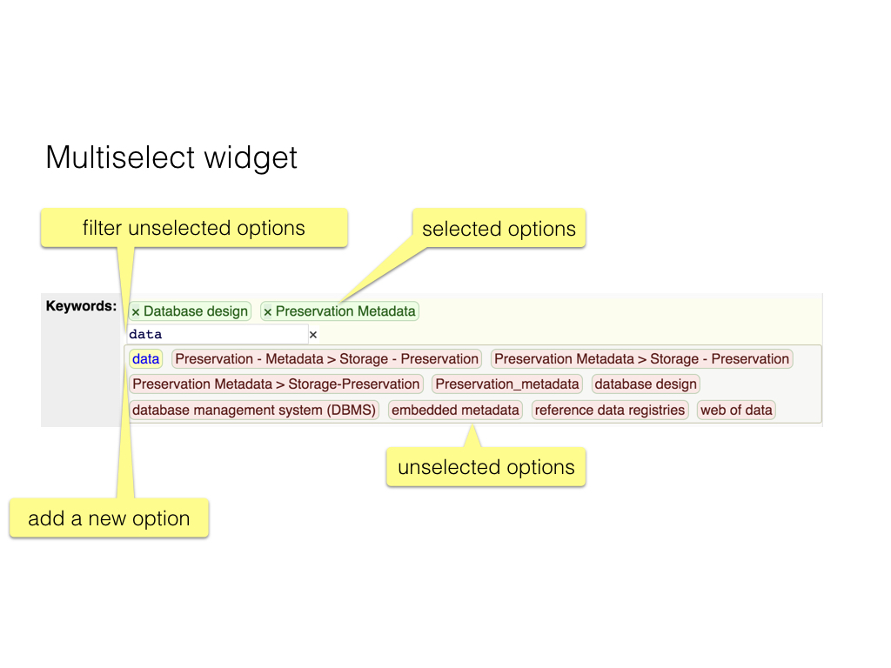

These are the [React](React) components, that make up the
part of the app that is visible in the browser.
They lean on the [dux](Dux) that work for them in the background.

Click on the names in the titles to view their source code on Github.

Components get *properties* as input (we call them *props*).
For each component we mention the props they expect and what type 
of data they represent.

However, some props occur over and over again, and we name them consistently.

Here is a list of those props and their types.
When mention these props later on, we omit the types.

* `tables` **object** A slice of the state. All data that comes from database tables.
  Organized by `table` name. For each table there is spec information
  and actual entity data. 
* `table` **string** Name of the table that the component must deal with.
* `filters` **object** A slice of the state. Contains the actual filter settings.
  Organized by table and then `filterId`. 
* `filterId` **number**

[main]({{site.appBase}}/main.jsx)
=============================================================================================
connected via [roots](Dux#roots)

Entry point of the client side app.
Contains the [routing](Routing), wrapped in a [Root](#roots) component, that
sets up the store in which the central state lives.

[App]({{site.appBase}}/components/App.jsx)
=============================================================================================
connected via [win](Dux#win)

As far as the logic of the web page is concerned, this is the top level component.

`App` is always in view and consists of the top navigation bar with

* logo, [Login](#login);
* [Notification](#notification));
* static links to documentation.

#### Props
###### win = { `height`, `width` }, numbers from [getWinDim](Dux#getwindim)
The height and width of the main window.
It is only used to display the height and the width somewhere on the screen.

###### `children` components

The sub-top level components that are placed under the App component.

[ByValue]({{site.appBase}}/components/ByValue.jsx)
=============================================================================================
connected via [filters](Dux#filters)

A widget by which the user can click the [facet](#facet)s associated with one field.
There is also a [collective checkbox](#checkboxi), by which the user can check or uncheck all facets in one go.
All values that occur are displayed, with statistics in the form *subtotal of total*.

#### Props
###### `tables` object

###### `table` string
The name of the table that is filtered.

###### `filterId` integer
The id (array index) of the filter in question.

###### `filterLabel` string
A label to be displayed on the interface.

###### `fieldValues` object from [getFieldValues](Dux#getfieldvalues)
A mapping of ids to values, for all values that this field has in this table.

###### `filteredAmount` number, `filteredAmountOthers` object, `amounts` object
The results of [applying](Dux#getfiltersapplied) the filter.

###### `maxCols` number
The maximum number of rows in which the facets have to be stacked.

###### `expanded` bool
Whether the facets should be expanded or collapsed (hidden).

[CheckboxI]({{site.appBase}}/components/CheckboxI.jsx)
=============================================================================================
(life cycle) connected via [filters](Dux#filters)

Displays a *collective* checkbox for a [facet filter](#ByValue) with many facets.

Clicking on this box will collectively check and uncheck all associate
checkboxes.

#### Props
###### `filterSetting` object from [getFilterSetting](Dux#getfiltersetting)
The checked states of all associated individual facets.

###### `handle` function is [changeFacetAll](Dux#changefacetall)
A callback to be invoked upon clicking the checkbox.

This checkbox can have an indeterminate state, if some but not all
of the associate checkboxes are checked.

We have to resort to a [DOM](React#dom) manipulation after rendering to get the
indeterminate state across.

[Doc]({{site.appBase}}/components/Doc.jsx)
=============================================================================================
presents [docs](Dux#docs)

Handles the display of documents.
Depending on the type of document (markdown, html, pdf) it delegates work
to specialized document components: [DocMd](#docmd), [DocHtml](#dochtml) and
[DocPdf](#docpdf).

#### Props
###### `location` object
From this object the property `pathname` will be read, which will be split
into directory, file and extension parts.
The extension is used to switch to the component for that type of documents.

[DocHtml]({{site.appBase}}/components/DocHtml.jsx)
=============================================================================================
presents [docs](Dux#docs)

Displays an HTML document by linking to it in an IFRAME.

#### Props
###### `docDir`, `docName`, `docExt` string
The directory, filename and extension of the document container.

[DocMd]({{site.appBase}}/components/DocMd.jsx)
=============================================================================================
(life cycle) connected via [docs](Dux#docs)

Component to show
[Markdown](https://guides.github.com/features/mastering-markdown/)
text, coming from files on the server.
The conversion to HTML is done client side,
and the user gets a control to switch between Markdown source and
formatted HTML.

#### Props
###### `docName` string
The name of the document.

###### `text` string from [getDoc](Dux#getdoc)
The raw content of the document.

###### `fetch` function is [fetchDoc](Dux#fetchdoc)
Method to fetch the data from the server if needed.

A function `RouterLink` is defined to wrap local links into `Link` components
when transforming the markdown to html.
It makes it possible to write Markdown documents with
internal links to this application.

A full link (with protocol `http`(`s`) is translated to a
plain HTML `a` element, so clicking it will leave this application.

[DocPdf]({{site.appBase}}/components/DocPdf.jsx)
=============================================================================================
presents [docs](Dux#docs)

Displays a PDF document by linking to it in an OBJECT.

**NB:** On iOS this does not work well, only the first page of the PDF gets shown,
we work around it by just displaying a link to open the PDF in a new tab.
We only do that when we detect an iOS browser.

###### `docDir`, `docName`, `docExt` string
The directory, filename and extension of the document container.

[EUMap]({{site.appBase}}/components/EUMap.jsx)
=============================================================================================
(life cycle) connected via [filters](Dux#filters)

A complex component!
It is a facet filter for the field *country*, using [ByValue](#byvalue) for that.
It also contains a map of Europe, visualizing by means of markers,
how the filter result is distributed over the DARIAH countries.

#### Props
The same props as [ByValue](#byvalue) plus:

###### `tables` object from [getTables](Dux#gettables)
Access to all fetched tables, of which only the *country* table is used here.

Both ingredients of this component are brought together not by
class extension but by *functional composition*.

The map is a [Leaflet](http://leafletjs.com) module on a blank pane,
with a [geojson]({{site.libBase}}/europe.geo.js) file of country boundaries laid out on it.
The map is not react aware, it will be rendered in its own div.
The [lifecycle](React#life-cycle) methods of this component set up the map and update when new filter settings have been applied.

### Compute Marker Radius

When we know the filter results per country, we can put markers on them
with a radius in proportion to their scores.
However, if the scores are very far apart, either the small markers get invisible,
or the big markers get too big.
We mitigate this effect, by using proportional radii only for values below a certain
threshold (`LEVEL_OFF`). For higher values we essentiall take the square root.

[Facet]({{site.appBase}}/components/Facet.jsx)
=============================================================================================
connected via [filters](Dux#filters)

Displays a single facet. Just a checkbox and a value representation.
The clicks received by the checkbox are passed upwards by means of a callback.

#### Props
###### `table` string
The name of the table that is filtered.

###### `filterId` integer
The id (array index) of the filter in question.

###### `valueId` string
The id of the value that is associated to this facet.

###### `valueRep` string
The string representation of the value that is associated to this facet.

###### `filterSetting` bool from [getFilterSetting](Dux#getfiltersetting)
Whether the facet is checked or not.

###### `handle` function is [changeFacet](Dux#changefacet)
Callback to be invoked when the facet is clicked.

Note that we use the strategy of [controlled components](React#controlled-component) here.

[FieldEdit]({{site.appBase}}/components/FieldEdit.jsx)
=============================================================================================
connected via [tables](Dux#tables)

Edit control for an editable field.
Depending on the type of the field and the multiplicity, it presents
the right control.
Basically, this component produces one or more 
[Field](http://redux-form.com/docs/api/Field.md/) 
or
[FieldArray](http://redux-form.com/6.8.0/docs/api/FieldArray.md/)
components (which are provided by [redux-form](https://redux-form.com). 

Note that we do not pass the actual values to these components.
They know how to get the current values from the state, and what actions
must be dispatched to change them.

However, both `<Field />` and `<FieldArray />` still do not actully present
the edit control. They only do the plumbing.

For the actual presentation, you can plugin a component of choice.
We will use `<input type="..." />`, `<textarea>...</textarea>` elements and
our own custom component [RelSelect](#relselect) for multiselect controls.

We enhance *textareas* by offering markdown previews of their content.
See [MarkdownArea](#markdownarea).

We wrap multiple *input*s in [InputMulti](#inputmulti) and single inputs
in [Input](#input).
The extra level of wrapping of these presentational components is needed
for showing validation errors.

#### Props
###### `name` string
The name of this field.

###### `tables` object from [getTables](Dux#gettables)
Where all information that has been fetched into tables can be found.

###### `table` string
The name of the table in question.

###### ...props any
There are many more props that get passed to `FieldEdit`. 
They have been injected by the wrapper
[reduxForm()](http://redux-form.com/6.8.0/docs/api/ReduxForm.md/) into
[ItemForm](#itemform), the parent of this component, and they are just passed
on to *Field* and *FieldArray*, so that they can do their magic.

#### Caution
In order to get everything working correctly, two problems had to be solved.
Both turned out to be related to Redux-Form.

* The component that you pass to the `component` prop of `Field` and `FieldArray`
  must not be dynamically composed in the `render()` function that produces `Field(Array)`.
  Because in that case, the `Field(Array)` is re-rendered too often,
  and effect for the user is that he loses focus after entering the first character, which is 
  *very* annoying.

  So, the value for `component` must be a static function. 
  But what if this function needs dynamically determined arguments?
  How can they be passed to it?
  The solution is simple: pass them as props to `Field(Array)`, and they will be passed
  on to the component function by redux-form.

  This is actually documented in the redux-form docs. You need 
  [this](http://redux-form.com/6.8.0/docs/api/Field.md/), section **2. A stateless function**

  > You must define the stateless function outside of your render() method,
  or else it will be recreated on every render and will force the Field to rerender
  because its component prop will be different.
  If you are defining your stateless function inside of render(),
  it will not only be slower, but your input will lose focus
  whenever the entire form component rerenders.

  and
  
  [this](http://redux-form.com/6.8.0/docs/api/Field.md/#props):

  > Any custom props passed to Field will be merged into the props object
  on the same level as the input and meta objects.

* When navigating between forms for several records, the `onChange` callback,
  that should be bound to the proper form, becomes bound to the wrong form.
  As far as I can see, all other things work as expected, so it was difficult to see
  why this occurred. The explanation is in a 
  [Github issue](https://github.com/erikras/redux-form/issues/2886).
  Summarized: the construction of the `onChange` function is effectively memoized.
  It is determined upon mounting of the component, but not on updating it.
  The workaround is easy: add an extra key property to the form.
  Another cause for the same problem I encountered in [InputMulti](Components#inputmulti),
  where I had memoized the callbacks for adding and removing values to/from a sequence.

[FieldRead]({{site.appBase}}/components/FieldRead.jsx)
=============================================================================================
connected via [tables](Dux#tables)

Presents the value(s) of a read-only field, based on *initial values*.
Note that value of type `textarea` will be rendered as formatted markdown.

#### Props
###### `name` string
The name of this field.

###### `tables` object from [getTables](Dux#gettables)
Where all information that has been fetched into tables can be found.

###### `table` string
The name of the table in question.

###### `myValues` any
The actual value for this field.
It could be a string, a number, or an object, or even an array of such things.

[Filter]({{site.appBase}}/components/Filter.jsx)
=============================================================================================
connected via [filters](Dux#filters)

A control to filter a list of items.
The following types of filters are implemented.
* [Fulltext](#fulltext): Search in a textual field for a pattern.
  The pattern is entered by the user,
  the search is incremental, after each keystroke the results are updated.
* [ByValue](#byvalue): Faceted search for values of a specific field.
  * [EUMap](#eumap): Faceted search on country, together with a map visualization

The list of the available filter types and their characteristics are not
configured on the client, but come from the server.

This generic component merely calls the specialized filter components
with the right props for each filter associated with a table.
Whereas the incoming props contain information for all filters,
each individual specialized filter is passed only the slice that is relevant to 
that one filter.

#### Props
###### `table` string
The name of the table that is filtered.

###### `fields`, `filterList` object from [getTableFilters](Dux#gettablefilters)
Information about the fields and their filters.
This information comes from the [tables](Dux#tables) part of the state.

###### `filteredAmount` object, `filteredAmountOthers` object, `amounts` object
The results of [applying](Dux#getfiltersapplied) the filters.

[Fulltext]({{site.appBase}}/components/Fulltext.jsx)
=============================================================================================
connected via [filters](Dux#filters)

Displays a full text search input field.
The characters entered in this field are passed upwards by means of a callback.
This is incremental search.
Not only the full text search, but also all other filters are computed upon each character entered.

#### Props
###### `table` string
The name of the table that is filtered.

###### `filterId` integer
The id (array index) of the filter in question.

###### `filterField` string
The name of the field being filtered.

###### `filterLabel` string
A label to be displayed on the interface.

###### `filterSetting` string from [getFilterSetting](Dux#getfiltersetting)
The current value of the search string.

###### `handle` function is [changeFulltext](Dux#changefulltext)
Callback to be invoked when the user is typing the search string.

Note that we use the strategy of [controlled components](React#controlled-component) here.

[Input]({{site.appBase}}/components/Input.jsx)
=============================================================================================
presents [tables](Dux#tables)

Shows an `<input type="..." />` control, and shows validation errors if the value entered
by the user does not validate.

It is a [controlled component](React#controlled-component).

#### Props
###### `meta` object
Contains attributes related to validation and edit state; is the value changed and unsaved,
invalid, and of so, for what reason?

###### `input` object
Contains attributes related to the actual value that is being held.
These attributes are passed verbatim to the underlying `<input />`.

###### `type` string
The *type* of `<input type="..." />`. It will go to the place of the dots.

[InputMulti]({{site.appBase}}/components/InputMulti.jsx)
=============================================================================================
presents [tables](Dux#tables)

Renders a sequence of
[Field](http://redux-form.com/6.8.0/docs/api/Field.md/) 
components on behalf of a
[FieldArray](http://redux-form.com/6.8.0/docs/api/FieldArray.md/)
component.
There are controls to remove values, and to add fresh, empty values.

Validation and normalization are done per individual *Field*.

It is a [controlled component](React#controlled-component).

#### Props
###### `component` function
The edit component that has to be rendered multiple times.

###### `type` string
The *type* of `<input type="..." />` (in case `component` is `input`.
It will go to the place of the dots.

###### `validate` function
Validation function. Takes a value and return undefined if all is well, and otherwise a reason why not.

###### `normalize` function
Transforms the entered value into a normalized value for saving.

###### `fields` array
The names of the individual fields.
If the collective name of this field is `foo`, than this array contains
`foo[0]`, `foo[1]`, etc, as many as their are values. These names are just strings.

###### `meta` object
Contains attributes related to validation and edit state; is the value changed and unsaved,
invalid, and of so, for what reason?

###### ...props any
There are many more props that must be passed to `Field`. 
They have been injected by the wrapper
[reduxForm()](http://redux-form.com/6.8.0/docs/api/ReduxForm.md/) into
[ItemForm](#itemform), the uncle (`InputMulti` is passed as attribute to `Field` which is
a child of [FieldEdit](#fieldedit)) of this component, and they are just passed
on to *Field* and *FieldArray*, so that they can do their magic.

[ItemContainer]({{site.appBase}}/components/ItemContainer.jsx)
=============================================================================================
(life cycle) connected via [tables](Dux#tables)

Container for a single record in a table.
This component is responsible for the database actions of fetching, inserting and deleting,
but not form input.

#### Props
###### `tables` object from [getTables](Dux#gettables)
Where all information that has been fetched into tables can be found.

###### `table` string
The name of the table in question.

##### `eId` string
Entity id of this record.

###### `fetch` function is [fetchItem](Dux#fetchitem)
Callback to fetch entity data from the server.

###### `insert` function is [insertItem](Dux#insertitem)
Callback to insert a create a new record in the database.
This will become the current record in view.

###### `del` function is [delItem](Dux#delitem)
Callback to delete the current record from the database.

[ItemDetails]({{site.appBase}}/components/ItemDetails.jsx)
=============================================================================================
connected via [tables](Dux#tables)

[ItemEdit]({{site.appBase}}/components/ItemEdit.jsx)
=============================================================================================
connected via [tables](Dux#tables)

[ItemForm]({{site.appBase}}/components/ItemForm.jsx)
=============================================================================================
connected via [tables](Dux#tables)

Manages the display and editing of a single record.
The component also shows *save* and *reset* buttons (if appropriate).

We use [redux-form](http://redux-form.com) as machinery for displaying forms,
filling them out, submitting them, sending the values to the database, validating and normalizing
values.

Although *redux-form* has an awesome functionality, it is far from trivial to get it integrated.

The work horses are the
[Field](http://redux-form.com/6.8.0/docs/api/Field.md/) 
and
[FieldArray](http://redux-form.com/6.8.0/docs/api/FieldArray.md/)
components.

These elements can be put in an arbitrary component, under a `<form/>` element.
The resulting component is enhanced by the
[reduxForm()](http://redux-form.com/6.8.0/docs/api/ReduxForm.md/) function.

The basic flow is this:

* we read the values of a record from the state and pass them to the redux-form component as *initial values*;
* *redux-form* manages its own slice of the state (`form`) and has its own set of actions to respond
  to user interactions;
* when the user interacts with the form, the work ends up in the `form` slice of the state;
* until the user *submits* the form:
  * the current values are sent to the database, and the updated record is read back from the database;
  * the updated values are passed to the form as new initial values
  * the form re-initializes itself, and the user can start again;
* when the user interrupts editing the form, and switches to another component, nothing is lost:
  * the edits are saved in the state;
  * when the form is mounted again, not only the initial values are fetched back, but also
    the edit state is restored.

Hence it is easy to edit two forms at the same time, which can be handy if (s)he edits two
contributions that need to have a consistent wording.
It is also possible to edit the same records in multiple components on the interface.
Both refer to the same underlying state.

#### Props
###### `tables` object from [getTables](Dux#gettables)
Where all information that has been fetched into tables can be found.

###### `table` string
The name of the table in question.

###### `eId` string
Entity id of this record.

###### initialValues
An object with the initial values of all fields that are being managed by the form as a whole.

###### `mod` function is [modItem](Dux#moditem)
Callback to send the updates to the current record to the database.

###### `perm` object
Permissions that the current user holds for this record (list, read, update, delete).

###### `fields` object
Object that contains all the fields in this record as keys. 
These are the fields that the user is permitted to see.

###### `form` string
Key to find the data of this form in the state, in the `form` slice, where *redux-form*
controls it. We use a key in the form *tableName*`-`*entityId*.

These are all the properties that `ItemForm` gets from its parent and from its connection with the
state.
But we wrap `ItemForm` in `reduxForm()` and this will inject a number of other properties
into it.
We list the few that we visibly use. There are more injected properties, and these we pass carefully
on to other components.

###### `dirty` boolean
Whether the form contains changed, unsaved values in any of its fields.

###### `invalid` boolean
Whether the form contains invalid, values in any of its fields.
The form uses two kinds of validation:

* synchronous: on every keystroke, the current value will be subjected to a validation function
* on submit: the submitted values will be validated on the server, and if that fails, the reasons
  for failure will be reported in exactly the same way as for synchronous validation.

###### `error` object
Object that contains the reasons for validation errors.

###### `submitting` boolean
Whether a submit action of the form is pending. 

###### `reset` boolean
A function that can reset the form.
Resetting means: changing all edited values back to the initialValues.

###### `handleSubmit` function
A function that is invoked when the form is submitted.
This function handles all the [redux-form](https://redux-form.com) machinery that is needed.
It also calls a function that you can pass to it as first argument.
We pass it our `toDb(table, eId, mod)` function.
This is a function that takes a `values` object, and calls `mod(table, eId, values)`,
where `mod` is the function that dispatches a server action: the `values` are sent
to the server, where they are used to update the record `eId` in `table`.  

### Implementation
The construction of the actual fields is done by a function `makeFields()`, that
generates an array of fragments, one for each field.
An editable field will be handled by a
[`<FieldEdit />](#fieldedit) component,
and a read-only field by a
[`<FieldRead />](#fieldRead) component.

[ItemRow]({{site.appBase}}/components/ItemRow.jsx)
=============================================================================================
connected via [tables](Dux#tables)

[ListContainer]({{site.appBase}}/components/ListContainer.jsx)
=============================================================================================
(life cycle) connected via [tables](Dux#tables)

Manages a table. Responsible for fetching data from the server.
The display of the (filtered) table is left to other components,
such as [ListFilter](#listfilter).

#### Props
###### `tables` object from [getTables](Dux#gettables)
Where all information that has been fetched into tables can be found.

###### `table` string
The name of the table in question.

###### `fetch` function is [fetchTable](Dux#fetchtable)
Callback to fetch table data and metadata from the server.

[ListFilter]({{site.appBase}}/components/ListFilter.jsx)
=============================================================================================
(life cycle) connected via [filters](Dux#filters)

Parent component of a table and all its filters.
The table must be present.
Fetching tables is done by other components, such as
[ListContainer](#listcontainer).
This component is for processing user interaction on the filters.
The filters and the list of filtered items are shown in separate
[Pane](#pane)s.

#### Props
###### `filteredAmount` object, `filteredAmountOthers` object, `amounts` object from [getFiltersApplied](Dux#getfiltersapplied)
The results of [applying](Dux#getfiltersapplied) the filters.

###### `initialized` bool
Whether the filters have been initialized.

###### `init` function is [setupFiltering](Dux#setupfiltering)
Callback to initialize filtering.

[ListGrid]({{site.appBase}}/components/ListGrid.jsx)
=============================================================================================
connected via [tables](Dux#tables)

[ListPlain]({{site.appBase}}/components/ListPlain.jsx)
=============================================================================================
(life cycle) connected via [filters](Dux#filters)

Displays a list of items from a table.
If filters are active on that table, this component is meant to just display the
filtered items.

#### Props
###### `tables` object from [getTables](Dux#gettables)
Where all information that has been fetched into tables can be found.

###### `table` string
The name of the table in question.

###### `title` string
The name of the field that will be used as the *title* of the record.

###### `filteredData` array
The list of ids of the records to be shown.
The full information of the records will be looked up from `tables` in the state.

###### `inplace` bool
Whether the title can be expanded to the full record by the user.

[Login]({{site.appBase}}/components/Login.jsx)
=============================================================================================
(life cycle) connected via [me](Dux#me)

The main task of Login is to fetch the current authentication status:
is there an authenticated user, and if so, what is his/her name?

#### Props
###### `me` object from [getMe](Dux#getme)
The information about the currently logged-in user, fetched from the server.

###### `fetch` function is [fetchMe](Dux#fetchme)
Callback to fetch user information from the server.

[MarkdownArea]({{site.appBase}}/components/MarkdownArea.jsx)
=============================================================================================
connected via [tables](Dux#tables)

An edit control for bigger chunks of text.
It is basically a `<textarea>...</textarea>` but it is enhanced to convert to the text
to markdown and to display a formatted preview of the text.
What is saved to the database is the raw markdown. 
The formatted text is ephemeral, its only function is for the pleasure of the user.
Note that in read-only view these values will be also rendered as formatted text.

#### Props
###### `table` string
The name of the table in question.

##### `eId` string
Entity id of this record.

###### `meta` object
Contains attributes related to validation and edit state; is the value changed and unsaved,
invalid, and of so, for what reason?

###### `input` object
Contains attributes related to the actual value that is being held.
These attributes are passed verbatim to the underlying `<input />`.

[NavLink]({{site.appBase}}/components/NavLink.jsx)
=============================================================================================
presents __none__

Displays a navigation link that is sensitive to routing.
That means: it is a link that can activate a component, and, when clicked,
it will become highlighted.

#### Props
###### activeClassName
The CSS class to be used when the navigation link has been clicked.

[NotFound]({{site.appBase}}/components/NotFound.jsx)
=============================================================================================
presents __none__

Displays a 404 if no
[route](React#routing) in [main](#main) matches.

#### Props
###### `splat` string
The text to display on the 404 page.

[Notification]({{site.appBase}}/components/Notification.jsx)
=============================================================================================
(life cycle) connected via [notes](Dux#notes)

Component that receives notifications and displays them in a
little panel with fixed position on the screen.
The panel is hidden by default and pops up if there is an important notification.
The user can click it away and also clear the notifications.

There is also a progress indicator, a little circle fixed at the top right corner of the screen.
It hints at the current status of asynchronous operations. A click on it will show the notifications panel.

#### Props
###### `notifications` array of objects from [getNotes](Dux#getnotes)
The list of notifications that have been issued since the beginning of the session or since the last time that the user has cleared the messages.

###### `busy` from [getNotes](Dux#getnotes)
The amount of asynchronous actions that are still pending.

###### `show` from [getNotes](Dux#getnotes)
Whether the panel should be hidden. 

###### `lastMsg`, `lastNote`, `lastKind` from [getNotes](Dux#getnotes)
The indexes of the last message and the last notable message, and the kind of the last notable message, which is one of `error`, `warning`, `special`.
Only the kind `info` is non-special.

When the notifications are displayed, the panel will be scrolled to the last notable message if there is one,
otherwise to the last message.

###### `clear` function is [clear](Dux#clear)
Callback by which the list of notifications can be cleared.

###### `display` function is [display](Dux#display)
Callback to be invoked when the user clicks the panel or the progress indicator to hide and show the notifications panel.

[Overview]({{site.appBase}}/components/Overview.jsx)
=============================================================================================

[RelSelect]({{site.appBase}}/components/RelSelect.jsx)
=============================================================================================
presents [select](Dux#select)

An implementation of multiselect widgets. 
There is a fairly complete [react-select](https://github.com/JedWatson/react-select) component on Github.
However, it has some flaws that prevents a successful usage of it in our app.
That is why I have written this component.

The capabilities of this widget are:

* single select or multiselect, depending on the property `multiple`;
* fixed list of values or the possibility to create new values on the fly, depending on the prop `allowNew`;
* options can be filtered by a full text filter;
* only one copy of an option can be chosen;
* selected options are removed from the list of selectable options;
* plays well with [Redux-Form](https://redux-form.com);

[Root]({{site.appBase}}/components/Root.jsx)
=============================================================================================
presents [roots](Dux#roots)

Top-level wrapping component to set up the central store. It does so
by configuring the store, calling [configureStore](Dux#roots), and passing
it to the special [Provider](React#redux) component of Redux.

Then it wraps the whole remaining app in a [Window](#window) component for 
detecting some global UI events.

#### Props
Except for the standard prop `children`, there are no props.

[Stat]({{site.appBase}}/components/Stat.jsx)
=============================================================================================
presents [filters](Dux#filters)

Displays a string of the form *subTotal* `of` *total*.
If one of the two is missing, the `of` will not display.

#### Props
###### `subtotal`, `total` number

[Static]({{site.appBase}}/components/Static.jsx)
=============================================================================================
presents __none__

Fixed navigation links to some static resources.

#### Props
None.

[SubApp]({{site.appBase}}/components/SubApp.jsx)
=============================================================================================
presents [win](Dux#win)

This is one of the components just below [App](#app).
It contains a set of panes and navigation links to main subcomponents to
display in those panes.

#### Props
###### `table` string
The name of the table of entities that is central to the subcomponent that
is displayed in the panes.

[Window]({{site.appBase}}/components/Window.jsx)
=============================================================================================
(life cycle) connected via [win](Dux#win)

Detects window resize events and passes the resulting height and width of
the main window to the state.

On mounting an event listener is installed, and on unmounting the event handler is
removed. During resizing, the frequency of emitted events is throttled to one per
second, in order to prevent screen flicker.

#### Props
###### `resize` function is [changeWinDim](Dux#changewindim)
Callback to deliver the new height and width of the browser window upon a resize event.
