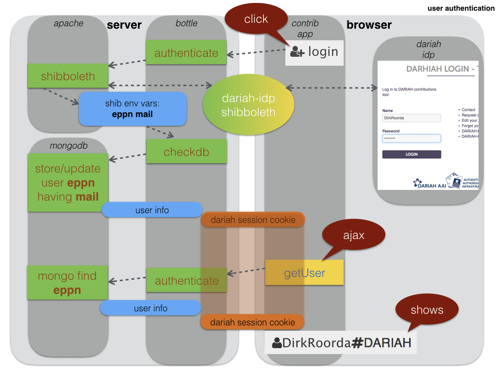
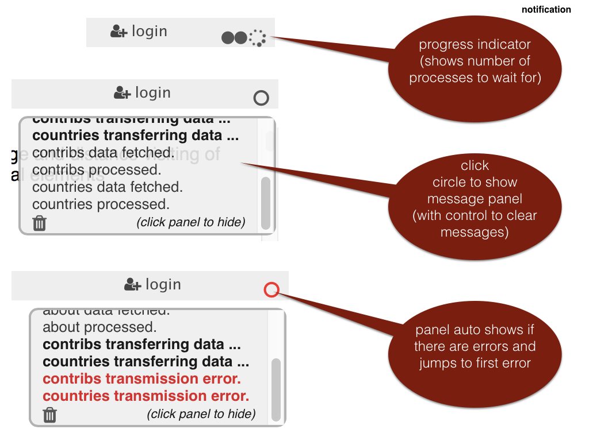
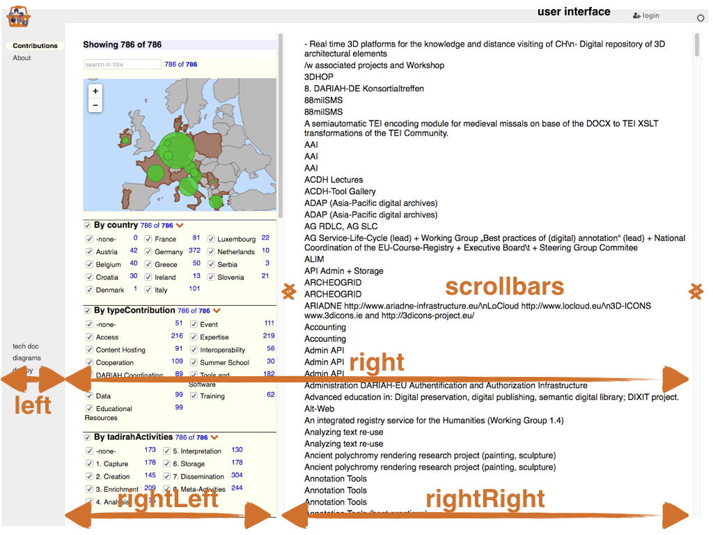

Dux are appliances within the app, i.e. sets of components that all work
with the same slice of the state.

We have organized dux as follows:

* one file that contains its *actions*, *reducer*, *selectors* and *helpers*.
* the reducer is programmed as an object of *flows*. For each action,
  there is a flow with the same name, which is a function that produces
  a new state on the basis of that action.
* a number of React components that make use of these by importing them.

This app contains the following dux:

* [alter](#alter)
* [docs](#docs)
* [filters](#filters)
* [me](#me)
* [notify](#notify)
* [roots](#roots)
* [select](#select)
* [tables](#tables)
* [win](#win)

[alter]({{site.appBase}}/dux/alter.js)
=============================================================================================
Hides and shows material on the user interface.
It is a bit more general than that: you can supply *n* alternatives and *n* controls,
and let the user cycle through the alternatives by clicking the controls.
The corresponding component is
[Alternative](Components#alternative).

The state remembers the index of the currently presented alternative, keyed by a tag.
All instantiations should offer a unique tag. 

There is no meaningful state initialization.
By default, the first choice is alternative 0.
But a component may specify an other initial value.

Actions
---------------------------------------------------------------------------
### nextAlt()
Only one action, with the instruction to go to the next alternative.
In the payload of this action is also the total number of alternatives (in order go to the first
alternative again after all the others), and an optional initial value.
If there is not yet a state for this instantiation, the initial value will be used to start from.

Reducer
---------------------------------------------------------------------------
Increases the index of the alternative by one, cyclically, and puts it under the right key in the state..

Selectors
---------------------------------------------------------------------------
### getAlt()
Delivers the number of the current alternative, or the initial value (from the
props of the connected component) or 0.

Helpers
---------------------------------------------------------------------------
No Helpers.

[docs]({{site.appBase}}/dux/docs.js)
=============================================================================================
Manages Markdown documents. Fetches raw source from the server and stores it into the state, under
a key, which is the path information of the document.
The [DocMd](Components#docmd) provides a widget for such documents.

Actions
---------------------------------------------------------------------------
### fetchDoc()
Fetches a document from the server asynchronously.

Reducer
---------------------------------------------------------------------------
Stores the fetched raw document source into the state.

Selectors
---------------------------------------------------------------------------
### getDoc()
Retrieves the stored data for the specified document.

Helpers
---------------------------------------------------------------------------
### needDoc()
Check whether a component contains the data for its document.

### changedDoc()
Check whether a component has new props in such a way that a new document should be fetched.

[filters]({{site.appBase}}/dux/filters.js)
=============================================================================================
Displays the list of items in the right column, but
only those that have passed all the filters, which are displayed in the
left column.

This is a complex system of components, where data is fetched from the server,
and user events are registered at the ilter widgets.
On top of that, there is a visualization in the form of a map of European countries
with markers having a radius indicative of the number of filtered items
by that country.

Actions
---------------------------------------------------------------------------
### changeFulltext()
Responds to a change in the search text in a
[Fulltext](Components#fulltext)
search widget.

### changeFacet()
Responds to a click in the checkbox of a
facet
[Facet](Components#facet).

### changeFacetAll()
Responds to a click to (de)select all facets of a field.

### setupFiltering()
Initializes filtering for a table. This action also looks at the tables slice of the state,
which is managed by [tables](#tables).

The initialization accomplishes the following things:

* for all the faceted fields a list of all possible values is made. The result
  is delivered to the caller, but also stored in a cache, because this part is
  done by a memoized function (see [memoBind](Lib#memo)
* for all fulltext filters and faceted filters new, initial filtersetting
  will be written to the state. This is the information that will be influenced
  by subsequent user clicks.

Reducer
---------------------------------------------------------------------------
Transforms the state in response to dispatched tickets, notably the `filterSettings` slice.
Well, it is a bit more complicated, because every table has its own filterSettings.

Selectors
---------------------------------------------------------------------------
Filter information is being translated from the state to props that can be consumed by components.
All the actual filter work is done here, but because it is rather complex, we have outsourced it to the *helpers*.

### getFilterSetting()
Reads the current settings of a filter and injects it as `filterSettings` into
the props of the receiving components, which are typically the filter widgets that receive user interaction:
[Fulltext](Components#fulltext)
[Facet](Components#facet), and also
[CheckboxI](Components#checkboxi),
[EUMap](Components#eumap).

### getFieldValues()
Reads a table of items (provided it has been downloaded from the server) and produces facet information.
The items are supposed to contain title fields and at least those fields that are subject to filtering.

For every field that is chosen for faceted browsing, the list of values will be compiled.

The result is used by 
[ByValue](Components#byvalue).
This component is responsible for all the facets of a field.

It is useful to store the results of this compilation, but where?
We do not store it in the state, because it is derived data, and we adhere to the principle that the
state is a
[normalized single source of truth](http://redux.js.org/docs/recipes/reducers/NormalizingStateShape.html).
Selectors are invoked upon each rendering, but in this case we do not want to redo the compilation all the time.
The solution is to use a
[memoized function](http://redux.js.org/docs/recipes/ComputingDerivedData.html).
I have created my own [memoizer](Lib#memo). 

Here you see that the helper function `compileFiltering` is used under memoization.
So, all those instances of `ByValue` quickly find their facet values upon each rendering.
 
### getFiltersApplied()
Applies the filters, according to the current filter settings.
Applying means: determine the subset of filtered items (`filteredData`), and provide statistics for the facets.

Every faceted field displays as total the amount of items filtered by all *other* filters (`filteredAmountOthers`).
For each of its facets, it displays how many items of this relative total correspond to that facet (`amounts`).

So this function delivers exactly that: `filteredData`, `filteredAmountOthers`, `amounts`.

It is also a costly function, but it does neet to be invoked upon each rendering caused by a click or a key press.

Helpers
---------------------------------------------------------------------------
### compileFiltering()
Computes facet values from the records of a table.

### initFiltering()
Computes initial filter settings, after `compileFiltering`.

### computeFiltering()
Applies the filters.

### placeFacets()
Distributes the facets of a field into a table, with a give maximum of rows.
This table can be presented to the user.

### testAllChecks()
Looks if all facets are checked, or all unchecked, of none of both.
Used to steer the *collective* checkbox that governs all facets.

[me]({{site.appBase}}/dux/me.js)
=============================================================================================
Powers the login widget, top right on the screen, realized by the component
[Login](Components#login).

The login procedure caters for shibboleth logins.
Upon successful login, the server sends information about the currently logged in user
to the client.

The actual login/logout actions take place at the server, by visiting `/login`,
`/logout` or `/slogout`.
The server delegates the actual authentication to the
[DARIAH Identity provider](https://wiki.de.dariah.eu/display/publicde/DARIAH+AAI+Documentation).

Currently, `/logout` performs a logout from this app, but not from the DARIAH Identity Provider.
To do the latter, one has to go to `/slogout` and close the browser.

The main task of Login is to fetch the current authentication status:
is there an authenticated user, and if so, what is his/her name?

**NB:** Because of the federated login, the username and password are not entered
in any form in this app. So the client does not know who the user is, except by asking the server.
The current user can be retrieved by `/api/db/who/ami`.

Actions
---------------------------------------------------------------------------
### fetchMe()
Fetches data about *me*, the logged in user.
It is actually handled by the helper 
[server](Lib#server).

Reducer
---------------------------------------------------------------------------
Transforms the state in response to dispatched ticket, notably the `me` slice.
It just contains the known attributes of a single user, the one that is logged in.

Selectors
---------------------------------------------------------------------------
### getMe()
Plainly hand over the attributes of the currently logged in user.
At the moment only the
[Login](Components#login)
component is interested in it.

Helpers
---------------------------------------------------------------------------
No helpers.

[notify]({{site.appBase}}/dux/notify.js)
=============================================================================================
Powers the notification widget, top right on the screen, realized by the component
[Notification](Components#notification).

A notification has a *kind* and a *text*.
The kind is one of `error`, `warning`, `special`, `info`.
All non-info messages are considered important.

Normally, the notification panel is hidden, but it can be called up by clicking on the progress circle in the
top-right of the screen.
The panel also shows up if there is a new important message, and it will scroll to the last important one.

The user can click away the panel and hide the messages.

Actions
---------------------------------------------------------------------------
### notify()
Issues its payload, which consists of an array of messages, as notifications.

### clear()
Clears the existing list of notifications.

### display()
Turns the visibility of notification panel on or off.

Other components can issue notifactions easily, either by importing these
actions, or by dispatching the right actions themselves.
The helper function [accessData](Lib#server) can issue notifications.
These notifications are given a the type `async` and convey a status `pending`,
`success`, or `error`.

Reducer
---------------------------------------------------------------------------
Transforms the state in response to dispatched ticket, notably the `notify` slice.
The state maintains a counter `busy`, which is the number of currently asynchronously pending operations.
A notification widget can show a progress spinner if `busy > 0`.

Selectors
---------------------------------------------------------------------------
### getNotifications()
The notification widget gets the notifications from the state, including `busy` and `show`, the latter
indicating whether the notification panel should be hidden or not.
For the convenience of the [Notification](Components#notification) component,
the index of the last important notification message is also computed, and its kind.

Helpers
---------------------------------------------------------------------------
### addItem()
A helper for the reducer, to add items to an array.

[roots]({{site.appBase}}/dux/roots.js)
=============================================================================================
Top level management of the state: initialization and combination of all the other dux.

Actions
---------------------------------------------------------------------------
### configureStore()
`Root` does not have proper actions of its own.
But it does set up the store, and passes it on to the [main](Components#main) component.

Reducer
---------------------------------------------------------------------------
Combines all slices of the state and combines all reducers that work their own slice of the state
into the *root reducer*, that operates on the whole state.

Selectors
---------------------------------------------------------------------------
### combineSelectors()
Utility function to combine several selectors.
Handy for components that use several slices of the state.

Helpers
---------------------------------------------------------------------------
No helpers.

[select]({{site.appBase}}/dux/select.js)
=============================================================================================
Manages the UI-state of the [RelSelect](Components#relselect) component. 
Every *RelSelect* instance must be identified by a tag, so that the states of the select controls
do not get confused. The most obvious choice for a tag value is a composition of the table name,
the entity id, and the field name.

Actions
---------------------------------------------------------------------------
### setSearch()
When a user types something in the search input field associated with the select control,
the search string is sent to the state.

### setPopUp()
Parts of the interface of the select widget will pop up after a user action, or disappear after an other user action.
This action sets the *popped up state* categorically to *true* or *false*, depending on a parameter.

### togglePopUp()
Toggles the popped up state of the relevant part of the widget.

Reducer
---------------------------------------------------------------------------
Straightforward merge of the payload of pop up actions and search string updates into the state.

Selectors
---------------------------------------------------------------------------
### getSelect()
Retrieves all state information of a *specific* select control, i.e. an instance identified by a tag.

Helpers
---------------------------------------------------------------------------
### initSelect()
Initializes the state for a specific select control. This is an initialization *per tag*.

[tables]({{site.appBase}}/dux/tables.js)
=============================================================================================
Manages database data from the server.
It keeps a normalized copy of the data.
When different components fetch the bits and pieces they need, it all lands here, properly organized.
This reduces the amount of fetching that is needed, and it improves consistency, because
all data consuming components look at the same data.

Principal data consuming components are [ItemFiltered](Components#itemfiltered) and
[ItemMy](Components#itemmy).

In order to do the job properly, a fair amount of metadata about tables and fields is also fetched and stored.
In particular, tables specify which filters can be used on which fields.
This filter setup is not hardwired into the client app, but comes from the server, where it is configured in 
the data model, a set of *yaml* files.

Actions
---------------------------------------------------------------------------
### fetchTable()
Fetches a complete table, but only the title fields and the fields needed for filtering.

### fetchTableMy()
Fetches *my* rows from a table, but only the title fields.
The server decides who I am and what my rows are.

### fetchItem()
Fetches a single rows from a table, all fields.
The server decides which fields I am allowed to retrieve.

If fields refer to other tables for their values, the above actions will
fetch these tables as well.

Reducer
---------------------------------------------------------------------------
The actions above potentially receive overlapping data.
The reducer takes care that all gets sorted out, and that every bit ends up in its proper place.

A table is stored under its name as key.
The table information is an object of entities (rows), keyed by their database id.
Next to the entities their is an array, called `order`, of ids that specifies the order.
If only *my* rows are being retrieved, there is an alternative array, called `my`, that contains 
the ids of the retrieved intities in the right order.

Next to the entity and order information there is field type information.
There is also information about permissions (read, insert, delete, update).

The entities themselves have a `values` object, with all the field values, keyed by field name.
Next to the values there is an attribute `complete` that tells whether
all fields for this entity have been fetched, or only the core fields.

As an example, consider the scenario that first the complete list of items is fetched, 
then the `my` items. The question is: after fetching the `my` items, will the full table that has been fetched before, be disturbed?
The answer is of course no. Because the reducer merges the `my` entities with
the existing entities. So the non-`my` entities are untouched.
But what about `order`?
Well, when reducing a `my-fetch` action, there is no incoming
`order` array but a `my` array instead, and the `order` that already exists on the state is not touched.

As a second example, consider the scenario where a single item is fetched first,
with all its fields, and then the full list of items, but with only title fields.
The question is: will the previously fetched item loose its extra fields?
The answer is of course no. Because the reducer merges the new entities' values
with existing entities' values.

Of all dux, this is the best example of what proper *reducing* is and what it achieves.
It might look hard to take care of this merging, under the constraint that only those branches of the state should be touched that are actually updated.
But the
[lodash mergeWith](https://lodash.com/docs/#mergewith)
makes this a breeze.
Have a look again at the [reducer source code]({{site.appBase}}/dux/tables.js) and
see how straightforward it is to code one of the most tricky reducers in this app.

Selectors
---------------------------------------------------------------------------
### getTables()
Just get all the table information in a prop called `tables`.

Helpers
---------------------------------------------------------------------------
### needTables()
Checks a list of table names to see if sufficient data is available in the state.

### needValues()
Checks a single entity in a single table to see if it contains values for all fields.

### changedItem()
Checks if properties have changed in such a few that new data should be fetched.

### repRelated()
Makes a representation of a related value. If a field in a table contains
an id of a record in an other table, the value for that id will be looked up and returned.

### repr()
Makes a streamlined string representation out of a field value. It looks up ids 
in related value list tables, and applies special formatting to fields that
refer to users and to countries.

[win]({{site.appBase}}/dux/win.js)
=============================================================================================
Reacts to window resizing by the user.
It will recompute the sizes of several [Pane](Components#pane)s on the screen,
so that everything stays in relatively good proportions on a single screen.

Actions
---------------------------------------------------------------------------
### changeWinDim()
Responds to window resizing, as set up in
[Window](Components#window).
It is just a matter of storing the `height` and the `width` of the window into the state.
Note that the event emitter in 
[Window](Components#window)
is being throttled, so that it does not run too frequently during the actual resizing.

Reducer
---------------------------------------------------------------------------
Transforms the state in response to dispatched ticket, notably the `win` slice.

Selectors
---------------------------------------------------------------------------
### getWinDim()
Reads the `height` and `width` from the state and transports them as props with
the same name.

Helpers
---------------------------------------------------------------------------
### initWinDim()
Based on the actual window size, it computes the sizes of designated areas on the screen.

