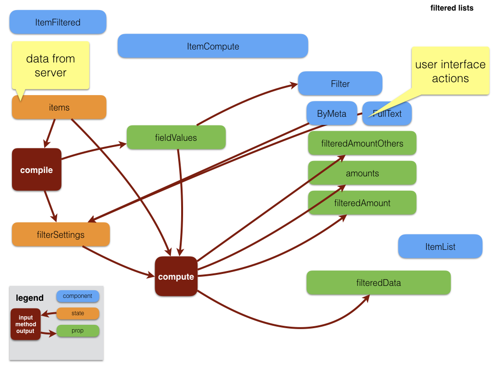
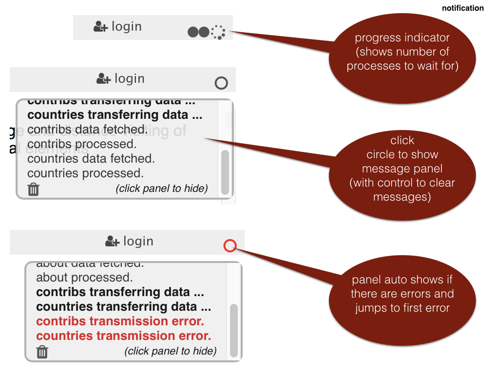

Dux (ducts) are appliances within the app, i.e. sets of components that all work
with the same slice of the state A duct is a connector between a slice of the
state and the components that work with that slice. As such, it is a piece of
plumbing, hidden behind the walls and under the floors.

We have organized dux as follows:

* one file that contains its _actions_, _reducer_, _selectors_ and _helpers_.
* the reducer is programmed as an object of _flows_. For each action, there is a
	flow with the same name, which is a function that produces a new state on the
	basis of that action.
* a number of React components that make use of these by importing them.

This app contains the following dux:

* [alter](#alter)
* [workflow](#workflow)
* [docs](#docs)
* [filters](#filters)
* [forms](#forms)
* [grid](#grid)
* [me](#me)
* [notes](#notes)
* [roots](#roots)
* [select](#select)
* [server](#server)
* [settings](#settings)
* [tables](#tables)
* [win](#win)

However, life is complicated, and the interplay between dux and components is no
exception. Sometimes actions will be fired that affect more than one slice of
the state.

For example, in order to set up filters for a table, both the `tables` slice and
the `filters` slice are needed. And when the user expands a table row into a
record form, the `alter` state is changed to cater for the expand action, and
the `tables` slice is changed by receiving additional data for that record.

In Redux, the slices of the state are not sealed off from each other. In the
end, there is one and only one reducer, that examines every dispatched action
for its `type` property, and hands it over to a sub-reducer that has
"subscribed" to handle actions for that type. It is perfectly possible that
multiple sub-reducers will deal with a single action.

A good example is when a record is displayed with multiple detail records,
displayed as a list of titles. There is a button "Open All" on the interface.
When it is pressed, data for all detail records is fetched, and the titles
expand into full record views for those details.

The way it is implemented, is that pressing "Open All" leads to the dispatch of
an action with type `fetchItems`, and with payload the list of ids of the
entities that must be fetched.

To this action, the `tables` sub-reducer reacts by fetching the corresponding
entity data from the server, and the `alter` sub-reducer reacts by expanding the
corresponding entity titles into full records.

Whenever you are tempted to write complicated, time-sensitive logic to
orchestrate what happens at multiple slices of the state, all that is needed is
in fact just an extra response of an other sub reducer.

# [alter]({{site.appBase}}/dux/alter.js)

A mechanism for switching between alternative representations of a component,
such as: expanded / collapsed, editable / read-only. It is a bit more general
than that: you can supply _n_ alternatives and _n_ controls, and let the user
cycle through the alternatives by clicking the controls.

Components that work with alternatives must collect them in a group. The name of
that group is passed as a prop called `alterSection`. Component that are passed
this prop, have access to the state of the alternatives in this group. To get
the state information for a single alternative, another key must be supplied,
usually called `alterTag`.

The component that displays the alternatives need not be the same component that
presents the controls to switch alternatives.

## Actions

Both actions below work relative an `alterSection` and `alterTag`.

### nextAlt

Switch to the next alternative. This action must specify the total number of
alternatives and an optional initial value. If there is not yet a state for this
instantiation, the initial value will be used to start from.

### setAlt

Switch to specified alternative.

### setItems

This function is used to switch a bunch of records from an open to a closed
state or vice versa.

## Reducer

Increases the index of the alternative by one, cyclically, and puts it under the
right keys in the state..

## Selectors

### getAltSection

Delivers the numbers of the current alternatives as far as they are registered
under the `alterSection` key in the `alter` slice of the state.

## Helpers

### compileAlternatives

A component that wants to work with the alternatives, of a group of components,
must call `compileAlternatives()` with the right parameters.

Think of a List component that wants to provide child items with a control to
expand themselves. It is more efficient that the List connects to the `alter`
state, than that each item connects to that state individually.

This function is a factory function that, given an `alterTag`, delivers an
object with functions for getting and setting the alternatives of that
particular instance.

### Caution

It is tempting to make one alterSection for all components in the app that need
alternatives. The flip side of doing so is that all those components will be
triggered for re-render whenever any single one of them switches alternatives.
That is why offer the possibility of grouping related components under the same
`alterSection` and be shielded from updates in the components that belong to
other `alterSections`.

# [docs]({{site.appBase}}/dux/docs.js)

Manages Markdown documents. Fetches raw source from the server and stores it
into the state, under a key, which is the path information of the document. The
[DocMd](Components#docmd) provides a widget for such documents.

## Actions

### fetchDoc

Fetches a document from the server asynchronously.

## Reducer

Stores the fetched raw document source into the state.

## Selectors

### getDoc

Retrieves the stored data for the specified document.

## Helpers

### needDoc

Check whether a component contains the data for its document.

### changedDoc

Check whether a component has new props in such a way that a new document should
be fetched.

# [filters]({{site.appBase}}/dux/filters.js)

Supports the display of filtered lists, where there is a bunch of filters and a
list with items filtered by those.

Lists and filters form a complex system of components, involving

* fetching list data from the server,
* fetching filter specifications
* fetching the metadata that is used by the filtering
* handling the user interactions with the filters
* supporting special effects such as a map of European countries with markers
	having a radius indicative of the number of filtered items by that country.

This duct not only needs data from the `filters` slice, but also from the
`tables` slice!

## Actions

### changeFulltext

Responds to a change in the search text in a [Fulltext](Components#fulltext)
search widget.

### changeFacet

Responds to a click in the checkbox of a facet [Facet](Components#facet).

### changeFacetAll

Responds to a click to (de)select all facets of a field.

### initFiltering

Initializes filtering for a table. This action also looks at the tables slice of
the state, which is managed by [tables](#tables). The actual work is done by a
memoized helper function: [compileFieldIds](#compilefieldids). On the basis of
this, initial settings of facet filters can be made. This is done by the helper
function [initFilterSettings](#initfiltersettings) and these settings are to be
added to the `filters` slice of the state under the key `table` and then under a
key `filterTag`. In this way you can set up various kinds of filtering for the
same table.

## Reducer

Transforms the state in response to dispatched actions, notably the `filters`
slice and within that a sliced keyed by `table`.

## Selectors

Filter information is being translated from the state to props that can be
consumed by components.

### getFilters

Reads the current settings of a filter and injects it as `filters` into the
props of the receiving components, which are typically the filter widgets that
receive user interaction: [Fulltext](Components#fulltext)
[Facet](Components#facet), and also [CheckboxI](Components#checkboxi),
[EUMap](Components#eumap).

## Helpers

### compileValues

For every field that is chosen for faceted browsing, the list of values will be
compiled.

The result is used by [ByValue](Components#byvalue). This component is
responsible for all the facets of a field.

It is useful to store the results of this compilation, but where? We do not
store it in the state, because it is derived data, and we adhere to the
principle that the state is a
[normalized single source of truth]({{site.redux}}/docs/recipes/reducers/NormalizingStateShape.html).
Selectors are invoked upon each rendering, but in this case we do not want to
redo the compilation all the time. The solution is to use a
[memoized function]({{site.redux}}/docs/recipes/ComputingDerivedData.html). I
have created my own [memoizer](Lib#memo).

### computeFiltering

Applies the filters, according to the current filter settings. Applying means:
determine the subset of filtered items (`filteredData`), and provide statistics
for the facets.

Every faceted field displays as total the amount of items filtered by all
_other_ filters (`filteredAmountOthers`). For each of its facets, it displays
how many items of this relative total correspond to that facet (`amounts`).

So this function delivers exactly that: `filteredData`, `filteredAmountOthers`,
`amounts`.

It is also a costly function, but it does need to be invoked upon each rendering
caused by a click or a key press.

### makeTag

Makes a `filterTag`, depending on the situation of the List of items that needs
the filtering. The most fundamental issue is: is the list showing all items in
the table, or my items only, or is it a list of detail records of some master
record in an other table?

### testAllChecks

Looks if all facets are checked, or all unchecked, of none of both. Used to
steer the _collective_ checkbox that governs all facets.

# [forms]({{site.appBase}}/dux/forms.js)

The `forms` slice of the state is under control of the
[Redux-Form]({{site.reduxFormBase}}) module. It contains all current form data
of components where the user is interacting with forms.

Some other components might want to know whether a component is engaged in data
entry or not, without fully connecting to all form state properties of
redux-form.

This duct gives that information and that information only.

## Actions

## Reducer

## Selectors

### getForms

Returns the set of keys of the `forms` slice of the state. It calls a memoized
function to turn the keys into a set. So, if the set of keys is asked repeatedly
without having been changed, exactly the same set object is being returned.

## Helpers

No helpers.

# [grid]({{site.appBase}}/dux/grid.js)

This duct support grid views of tables, by managing sorting information of the
grid columns. Every grid table must identify itself with a `gridTag` and its
data resides on the `grid` slice of the state under that tag.

## Actions

### resetSort

Removes all sorting information under a `gridTag`.

### addColumn

Adds a sorting column. Grids can be sorted by multiple columns.

### delColumn

Deletes a sorting column.

### turnColumn

Toggles the sort method between ascending and descending for a specified column.

## Reducer

Applies the state changes, defined by the actions, to the `grid` slice, under
the key `gridTag`.

## Selectors

### getGrid

Returns the `grid` slice of the state.

## Helpers

### compileSortedData

This function actually applies a given sort order to a list of ids of items from
a table.

# [me]({{site.appBase}}/dux/me.js)

Powers the login widget, top right on the screen, realized by the component
[Login](Components#login).

The login procedure caters for shibboleth logins. Upon successful login, the
server sends information about the currently logged in user to the client.

The main task of Login is to fetch the current authentication status: is there
an authenticated user, and if so, what is his/her name?

**NB:** Because of the federated login, the username and password are not
entered in any form in this app. So the client does not know who the user is,
except by asking the server. The current user can be retrieved by
`/api/db/who/ami`.

## Actions

### fetchMe

Fetches data about _me_, the logged in user. It is actually handled by the
helper [server](Lib#server).

## Reducer

Transforms the state in response to dispatched ticket, notably the `me` slice.
It just contains the known attributes of a single user, the one that is logged
in.

## Selectors

### getMe

Plainly hand over the attributes of the currently logged in user. At the moment
only the [Login](Components#login) component is interested in it.

## Helpers

No helpers.

# [notes]({{site.appBase}}/dux/notes.js)

Powers the notification widget, top right on the screen, realized by the
component [Notification](Components#notification).

A notification has a _kind_ and a _text_. The kind is one of `error`, `warning`,
`special`, `info`. All non-info messages are considered important.

Normally, the notification panel is hidden, but it can be called up by clicking
on the progress circle in the top-right of the screen. The panel also shows up
if there is a new important message, and it will scroll to the last important
one.

The user can click away the panel and hide the messages.

## Actions

### notify

Issues its payload, which consists of an array of messages, as notifications.

### clear

Clears the existing list of notifications.

### display

Turns the visibility of notification panel on or off.

Other components can issue notifications easily, either by importing these
actions, or by dispatching the right actions themselves. The helper function
[accessData](Lib#server) can issue notifications. These notifications are given
the type `async` and convey a status `pending`, `success`, or `error`.

## Reducer

Transforms the state in response to dispatched ticket, notably the `notes`
slice. The state maintains a counter `busy`, which is the number of currently
asynchronously pending operations. A notification widget can show a progress
spinner if `busy > 0`.

## Selectors

### getNotes

The notification widget gets the notifications from the state, including `busy`
and `show`, the latter indicating whether the notification panel should be
hidden or not. For the convenience of the
[Notification](Components#notification) component, the index of the last
important notification message is also computed, and its kind.

## Helpers

No helpers.

# [roots]({{site.appBase}}/dux/roots.js)

Top level management of the state: initialization and combination of all the
other dux.

## Actions

### configureStore

`Root` does not have proper actions of its own. But it does set up the store,
and passes it on to the [main](Components#main) component.

## Reducer

Combines all slices of the state and combines all reducers that work their own
slice of the state into the _root reducer_, that operates on the whole state.

## Selectors

## Helpers

No helpers.

# [select]({{site.appBase}}/dux/select.js)

Manages the UI-state of the [RelSelect](Components#relselect) component. Every
_RelSelect_ instance must be identified by a tag, so that the states of the
select controls do not get confused. The most obvious choice for a tag value is
a composition of the table name, the entity id, and the field name.

## Actions

### setSearch

When a user types something in the search input field associated with the select
control, the search string is sent to the state.

### setPopUp

Parts of the interface of the select widget will pop up after a user action, or
disappear after an other user action. This action sets the _popped up state_
categorically to _true_ or _false_, depending on a parameter.

### togglePopUp

Toggles the popped up state of the relevant part of the widget.

## Reducer

Straightforward merge of the payload of pop up actions and search string updates
into the state.

## Selectors

### getSelect

Retrieves all state information of a _specific_ select control, i.e. an instance
identified by a tag.

## Helpers

### compileOptions

Initializes the state for a specific select control. This is an initialization
_per tag_.

# [server]({{site.appBase}}/dux/server.js)

Here all interaction with the server is managed. All activity that involves
waiting for a server, will eventually reach out to actions here. The actions
below only are concerned with requesting a server response, waiting for it, and
reporting success or failure.

Before a request is made, it is checked whether that request has been submitted
before and is still pending. In that case, the _request counter_ will be
increased, and no new request will be made.

* request counters that are non-zero correspond to requests that are either
	pending, or have ended in failure;
* pending requests have positive request counters, the number represents the
	number of requests the app has tried to make so far (only 1 request will be
	issued effectively);
* successful request have their request counter set to 0 again.

## Actions

### accessData

Asynchronous action to fetch data from the server, and also to send data to it.

A `task` object specifies what to fetch, and can contain data to send to the
server.

It can be used for database queries or file content. During the stages of a
request, [notify](Dux#notes) actions will be dispatched.

#### progress

This action represents the situation that a request is offered multiple times
before the first one has been completed. The request will not be made, but the
request counter will be increased.

#### ask

Just before a request is made, this action sets the request counter to 1.

#### err

When a request returns failure, the request counter is set to -1.

#### succeed

When a request returns success, the request counter is set to 0.

## Reducer

Manages the request counter and puts it under a key under the `server` slice of
the state. The key is identical to the `path` of the request (the URL that is
fired to the server).

### Note

But all actions except `accessData` are also picked up by the [notes](#notes)
reducer, where they result in notifications.

## Selectors

There are no selectors. So far, no component needs this slice of the state.

## Helpers

No helpers.

# [settings]({{site.appBase}}/dux/settings.js)

Cross cutting settings for the app are defined here. The `settings` slice of the
state is just a store of keys and values.

## Actions

### set

Adds a key value pair.

## Reducer

Straightforward reducer.

## Selectors

### getSettings

Returns the `settings` slice of the state.

## Helpers

No helpers.

# [tables]({{site.appBase}}/dux/tables.js)

Manages database data from the server. It keeps a normalized copy of the data.
When different components fetch the bits and pieces they need, it all lands
here, properly organized. This reduces the amount of fetching that is needed,
and it improves consistency, because all data consuming components look at the
same data.

Principal data consuming components are
[ListContainer](Components#listcontainer) and [Items](Components#itemmy).

In order to do the job properly, a fair amount of metadata about tables and
fields is also fetched and stored. In particular, tables specify which filters
can be used on which fields. This filter setup is not hard-wired into the client
app, but comes from the server, where it is configured in the
[data model](Model).

## Actions

### fetchTable

Fetches a complete table, but only the title fields and the fields needed for
filtering.

### fetchTables

Fetches a list of tables by successively calling `fetchTable`.

### fetchItem

Fetches a single rows from a table, all fields. The server decides which fields
I am allowed to retrieve.

If fields refer to other tables for their values, the above actions will fetch
these tables as well.

### fetchItems

Fetches a selection of rows from a table, all fields. The selection is given by
a list of `_id`s to fetch. The server decides which fields may be retrieved.

### modItem

Sends a request to update an item to the server, and merges the answer (the
updated values) into the state.

### insertItem

Sends a request to insert an item to the server, and merges the answer (the
inserted item) into the state.

### delItem

Sends a request to delete an item to the server, and updates the state to
reflect the deletion of that item.

## Reducer

The actions above potentially receive overlapping data. The reducer takes care
that all gets sorted out, and that every bit ends up in its proper place.

A table is stored under its name as key. The table information is an object of
entities (rows), keyed by their database id. Next to the entities their is an
array, called `order`, of ids that specifies the order. If only _my_ rows are
being retrieved, there is an alternative array, called `my`, that contains the
ids of the retrieved entities in the right order.

Next to the entity and order information there is field type information. There
is also information about permissions (read, insert, delete, update).

The entities themselves have a `values` object, with all the field values, keyed
by field name. Next to the values there is an attribute `complete` that tells
whether all fields for this entity have been fetched, or only the core fields.

As an example, consider the scenario that first the complete list of items is
fetched, then the `my` items. The question is: after fetching the `my` items,
will the full table that has been fetched before, be disturbed? The answer is of
course no. Because the reducer merges the `my` entities with the existing
entities. So the non-`my` entities are untouched. But what about `order`? Well,
when reducing a `my-fetch` action, there is no incoming `order` array but a `my`
array instead, and the `order` that already exists on the state is not touched.

As a second example, consider the scenario where a single item is fetched first,
with all its fields, and then the full list of items, but with only title
fields. The question is: will the previously fetched item loose its extra
fields? The answer is of course no. Because the reducer merges the new entities'
values with existing entities' values.

Of all dux, this is the best example of what proper _reducing_ is and what it
achieves. It might look hard to take care of this merging, under the constraint
that only those branches of the state should be touched that are actually
updated.

But the [lodash mergeWith]({{site.lodash}}/#mergewith) makes this a breeze.

Unfortunately, this library does not always leave unchanged values untouched,
which results in unnecessary re-renderings of components.

The best solution turned out to be [Immutability-Helper]({{site.immutability}}).

If you want to dive deeper into this issue, see the
[tests about merging](Tests#merge), which includes tests that makes this issue
crystal clear.

The methods of the Immutability-Helper have a syntax inspired by the MongoDB
commands, which is a nice reduction of cognitive load, since we use MongoDB at
the server side.

Have a look again at the [reducer source code]({{site.appBase}}/dux/tables.js)
and see how straightforward it is to code one of the most tricky reducers in
this app.

This reducer actively covered by [tests](Tests#tablesreducer). Have a look at
them to get more feeling of how table actions cause state transitions.

## Selectors

### getTables

Return the whole `tables` slice of the state.

## Helpers

### entityHead

Computes the title for an item, based on the [data model](Model) or on
specialized functions, defined here. See also [repr](#repr).

### needTable

Checks if sufficient `table` data is available in the state.

### needTables

Checks a list of table names to see if sufficient data is available in the
state.

### needValues

Checks a single entity in a single table to see if it contains values for all
fields.

### listValues

Gives the list of all values of a specified field in a table.

### presentUser

Presents a user, by means of name, email address, and/or `eppn`, depending on
what information is available, which also depends on what information may be
shared with the currently logged in user.

### changedItem

Checks if properties have changed in such a few that new data should be fetched.

### headEntity

The head line of a record, based on its title field and/or other data. For some
specific tables custom logic is used.

### repr

Makes a streamlined string representation out of a field value. It looks up ids
in related value list tables. For some tables, special representation functions
will be invoked. (users, countries, etc.).

### toDb

Dispatches an item modification action to the store.

### handleOpenAll

When a user clicks on an _Open All_ button, this function is invoked to fetch
the corresponding records (if needed).

### handleCloseAll

When a user clicks on an _Close All_ button, this function is invoked to
collapse the corresponding records and remove the `_id`s of the previously open
records from the URL, using
[browserHistory]({{site.reactRouterTutorial}}/lessons/10-clean-urls).

# [win]({{site.appBase}}/dux/win.js)

Reacts to window resizing by the user. It will deliver the new window size after
resizing. Useful for components that care about the window size, such as
[App](Components#app).

## Actions

### changeWinDim

Responds to window resizing, as set up in [Window](Components#window). It is
just a matter of storing the `height` and the `width` of the window into the
state. Note that the event emitter in [Window](Components#window) is being
throttled, so that it does not run too frequently during the actual resizing.

## Reducer

Transforms the `win` slice of the state in response to resize events.

## Selectors

### getWinDim

Returns the `win` slice of the state, which is just the current width and height
of the browser window.

## Helpers

No helpers.

# [workflow]({{site.appBase}}/dux/workflow.js)

A lot of the logic of showing lists, items, related items and fields is purely
generic and driven by the [data model](Model).

But there is considerably more to an app than this kind of generic logic. The
`workflow` duct is the entry point for additional, non-trivial business logic.

It is still in development.

### Active items

The `package` table determines a lot about the assessment process. It has
records with a specified startDate end endDate. The packages that have started
and are not yet passed there endDate are the _active_ packages. Normally there
will be exactly one package.

From the active package derive a number of other active concepts:

* the contribution types listed in the `typeContribution` field of the active
	package are the _active types_
* the criteria that are details of the active package are _active criteria_.

The generic List and Item components can be made sensitive to this notion of
activity. Active items can be formatted specially, and likewise the non-active
items, which can also be disabled in some contexts.

The way (in)active items are displayed is controlled by the [data model](Model).
See for example the field `typeContribution` in the tables `package` and
`criteria`.

## Actions

## Reducer

## Selectors

## Helpers

### compileActive

Computes the active packages, types and criteria and deliver them in an object,
keyed by kind of item and containing an array of active item MongoDB ids for
that kind.

### assessmentScore

Computes the overall score of an assessment, based on information that is on the
client.

The data returned is an object containing:

* `overall`: the overall score as percentage of points scored with respect to
	total of scorable points
* `relevantScore`: the sum of the scores for all criteria that have not been
	scored as `-1` (non-applicable)
* `relevantMax`: the total of the maximum scores for all criteria that have not
	been scored as `-1`
* `allMax`: the total of the maximum scores for all criteria
* `relevantN`: the number of criteria that have not been scored as `-1`
* `allN`: the number of criteria.

See more about the computation in [Workflow](Workflow#scoring).
