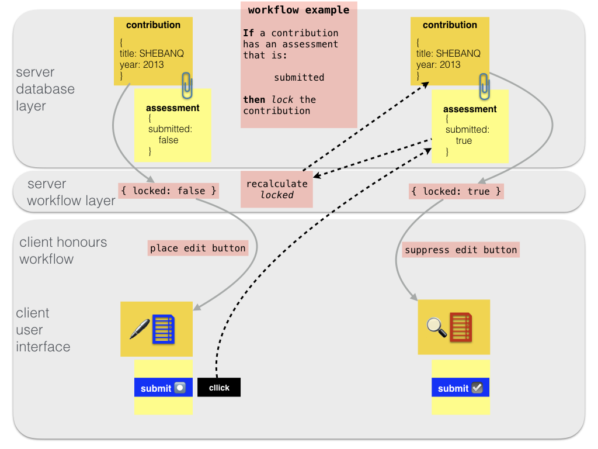
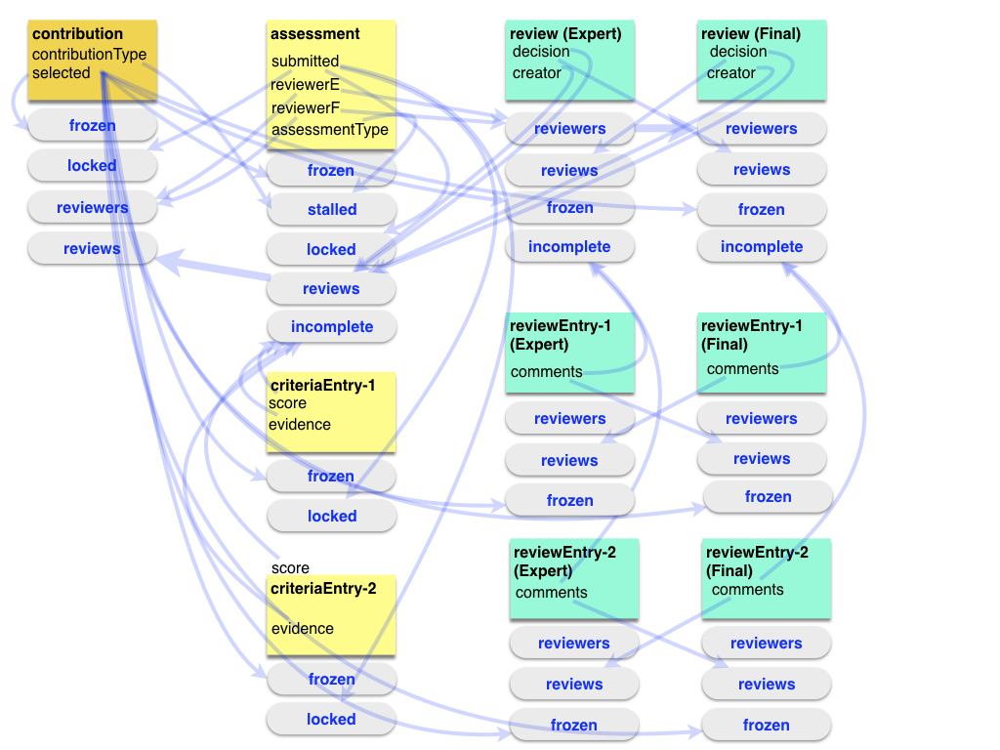

# Workflow Engine

## Description

The workflow engine of this app is a system to handle business logic.

Whereas the database consists of neutral things (fields, records, lists), the
workflow engine weaves additional attributes around it, that indicate additional
constraints.



These additional *workflow* attributes are computed by the server on the fly,
and then stored in a separate table in the database: `workflow`. From then on
the following happens with the workflow attributes:

*   they are sent to client, together with the *permission* information for each
    record
*   the client uses the workflow info to show or hide workflow related controls,
    and to suppress controls that lead to actions that violate the business logic
*   the server uses the workflow info to enforce the business logic;
*   the server updates the workflow attributes after any insert/update/delete
    action.

No matter how good a job the client does in supporting the business logic and
prohibiting actions that violate the business logic, the server always has the
last word. Every access to bits and pieces in the database is first subjected to
the permissions (a lower layer) and then to the additional workflow constraints.

## Realization

Workflow is realized at the server and at the client. To a large extent, its
rules are specified in the
[data model](../Concepts/Model.md)
.

??? abstract "Client"
    Workflow logic is predominantly used in the
    [templates](Templates.md)
    ,
    which may
    include workflow buttons and info panels.

    The workflow attributes are handled in the Dux
    [workflow](../Client/Dux.md#workflow)
    .

    There are also helper functions
    to compute special items based on workflow information.

    The templates
    themselves are applied by functions defined in the library
    [templates](../Client/Lib.md#templates)
    .
    These functions are given
    workflow attributes as arguments that they pass on to the templates.

The heart of the workflow code is at the server, in
[workflow.py]({{serverBase}}/controllers/workflow.py)
.
Its functions are
called from
[db.py]({{serverBase}}/controllers/db.py)
in many places.

The principal functions exported are discussed here.

??? abstract "readWorkflow"
    Given a document in some table, this function loads the workflow attributes for
    that document (if any). The attributes are loaded from the workflow table. That
    table has records with fields `table`, `eId` and `attributes`, where `table` and
    `eId` specify exactly which the record in question is, and `attributes` is a
    dictionary of all workflow data for that record that is currently stored.

    ??? note "read or compute"
        If `compute=True` is passed, the workflow attributes will be computed.
        In many cases, the workflow attributes can just be read from the workflow table.
        But if critical data has just been modified, the workflow information has to be
        recomputed.
        See `adjustWorkflow` below how it is configured which data will trigger
        recomputation of workflow attributes.

    The determination of workflow attributes is dictated by the
    [data model](../Concepts/Model.md)
    ,
    in the individual
    [tables]({{serverBase}}/models/tables)
    ,
    under the key
    `workflow/read`.

    There you find a sequence of instructions by which the system can compute
    workflow attributes for each record in a table.

    All instructions specify a list of other documents to 
    [inspect](#inspecting-other-documents)
    and a method to
    [compute](#computing-attributes)
    a value from the inspected documents.

    ??? example "assessment submission"
        As an example, we show an instruction for a contribution record
        to inspect related values in its assessment records on the basis of which
        it delivers the workflow attribute `locked`.

        The
        [contrib model]({{serverBase}}/models/tables/contrib.yaml)
        specifies:

        ```yaml
        workflow:
          read:
            - inspect: details
              method: hasValue
              linkField: contrib
              otherTable: assessment
              otherField: submitted
              myField: null
              value: true
              attribute:
                name: locked
                desc: being assessed
        ```

        Basically, this instructs the system to look at various other tables and records
        and fields, and if certain conditions are met the attribute `locked` 
        is added to the workflow attributes.
        Note that part of the attribute is a description, which explains the
        reason why the attribute is set. 
        The client may decide to show this reason on the user interface.

        Line by line:

            inspect: details

        This is an instruction to look into the detail record(s) of the current record.
        Other possible values are:
        `master`, `self`, with obvious meanings.
        [Inspecting other Documents](#inspecting-other-documents)
        below.

            method: hasValue

        The name of the method by which the inspected value is taken and turned in
        either `True` or `False`. There is a fixed, limited supply of methods, which are
        hard-coded in the program, see
        [Computing Attributes](#computing-attributes)
        below.

        Not all of the following parameters need to be present for all methods, and
        there are more possible parameters.
        The list of parameters is dependent on both the inspect method and the compute
        method.

            emptyFields:
              - score
              - evidence

        a list of fields in the other table that will be checked for emptiness.

            linkField: contrib

        This is the name of the field by which detail records point to their master.

            otherTable: assessment

        This is the name of the other table (which can be the master table, the details
        table, or the own table, depending on the value of `inspect`).

            otherField: submitted

        The name of the field in the other table to look at.

            myField: null

        The name of the field in the own table to look at.

            value: true

        A reference value to compare the inspected value with.


??? abstract "adjustWorkflow"
    Whereas `readWorkflow` computes all relevant workflow for a given record in a
    given table, `adjustWorkflow` delivers a list of *other* records in other
    tables, that need new workflow attributes after a change in a given record,
    whether it be an insert, update or delete.

    The determination of these attributes is dictated by the
    [data model](../Concepts/Model.md)
    ,
    in
    the individual
    [tables]({{serverBase}}/models/tables)
    ,
    under the key
    `workflow/adjust`.

    Typically, when a record gets workflow attributes based on master or detail
    records, these attributes must be updated on any change in the master or in one
    of the details. The system is not clever enough to generate these adjust rules
    itself. We have to do that.

    For this, one can specify rules that define `triggerFields` for collections of
    related records. When one of those trigger fields get changed, all specified
    related records will get their workflow attributes recomputed.

    ??? example "assessment submission"
        Let us look at the same example, but now at its `adjust` rule
        in the
        [assessment table]({{serverBase}}/models/tables/assessment.yaml)

        ```yaml
        adjust:
        - inspect: master
          linkField: contrib
          otherTable: contrib
          triggerFields:
            - assessmentType
            - submitted
        ```

        It says that if an assessment record is changed, some other records are
        affected, namely its master record in the `contrib` table. But not all changes
        in the assessment trigger adjustments, only changes in one of the
        `triggerFields`, in this case obviously the field `submitted`.

        ??? explanation "other trigger fields"
            The other trigger field, `assessmentType` is mentioned because of an other
            workflow rule, which we have not mentioned here.

        ??? note "triggers also on `linkField`"
            The system adds
            the `linkField` silently to the `triggerField`, because if we, for whatever
            reason, reassigned this assessment to a different contribution,
            then that contribution has to know it!

??? abstract "enforceWorkflow"
    Finally, the server has to know the consequences of the workflow attributes for
    behaviour. This is dictated in the generic
    [data model](../Concepts/Model.md)
    ,
    under the key
    `workflow/prevent/`*attribute* where `attribute` is a name such as `locked` or
    `incomplete`, or `frozen`.

    For each attribute there are optional constraints for the `update` and `delete`
    actions.

    ```yaml
    prevent:
      locked:
        delete: true
        update: true
    ```

    means that it is forbidden to delete or update a record that carries the `locked`
    attribute.

    ??? hint "relax update constraints"
        We can relax update constraints in several ways:

        ??? abstract "make an exception for some fields"
            ```yaml
            prevent:
              locked:
                update: except
            ```

            means that updating is not allowed except for some fields for which
            has been made an exception.

            ??? explanation "Where to define exception fields?"
                The list of exceptions is defined in the
                workflow configuration of the table in question, e.g.

                ```yaml
                  - inspect: self
                    method: hasValue
                    otherField: submitted
                    value: true
                    attribute:
                      name: locked
                      except:
                        - submitted
                        - reviewerE
                        - reviewerF
                      desc: is being reviewed
                ```

                In words, if an assessment has been submitted and is therefore locked,
                the submitted status and the reviewers can still be changed.

        ??? abstract "prevent certain fields to change"
            ```yaml
            prevent:
              locked:
                update:
                  submitted: true
            ```

            means that any update that changes the value of the field `submitted` is
            forbidden.

        ??? abstract "prevent certain fields to get a specific value"
            Here we take a real example, under attribute
            `stalled` instead of `locked`:

            ```yaml
            prevent:
              stalled:
                update:
                  submitted:
                    after: true
            ```

            This means that any update that leads to field `submitted` having value `true`
            is forbidden.

            ??? explanation
                Here we say that a stalled assessment cannot be submitted. For the sake of
                clarity, here is the rule that says when an assessment is `stalled`:

                ```yaml
                  workflow:
                    read:
                      - inspect: master
                        method: hasDifferent
                        linkField: contrib
                        otherTable: contrib
                        otherField: typeContribution
                        myField: assessmentType
                        value: null
                        workflow:
                          stalled: true
                          stalledReason: assessment type is different from contribution type
                ```

                In words: if an assessment has an `assessmentType` field with a different value
                that the `contributionType` field of its master contribution, then the
                assessment counts as stalled.

??? abstract "manageWorkflow"
    When the web server loads, it makes sure that correct workflow information is
    stored in the workflow table. It does so by dropping the existing workflow table
    and recomputing all workflow information from scratch.

    A sysadmin can also reset the workflow from within the app. Then the workflow
    table will be cleared (not dropped), and all workflow info will be recomputed.

    The
    [WorkflowInfo](../Client/Components.md#workflowinfo)
    component presents the previous
    resets since the web server was last started, and gives an overview of the
    recomputed workflow attributes.

## Inspecting other documents

Both `readWorkflow` and `adjustWorkflow` have instructions to look up related
documents and then apply a computing method to all those documents.

The target documents can be specified with these instructions:

??? abstract "self"
    Don't look further, look at yourself. The information from which
    workflow attributes are to be derived, is already present in the document
    itself.

??? abstract "master"
    Look at your master document. A document can have multiple masters,
    so you have to specify

    *   `linkField`: the field in yourself that points to the master,
    *   `otherTable`: the table in which the master document resides.

??? abstract "details"
    Look at your detail documents. A document can have multiple kinds of
    details, so you have to specify

    *   `otherTable`: the table that holds the details, and the
    *   `linkField`: the field in the detail document that points to you.

??? abstract "siblings"
    Look at records with the same master. You have to specify

    *   `linkField`: the field in yourself and your siblings that points to the master
    *   `otherTable`: the table in which your siblings reside

## Computing attributes

When the other documents have been found, it is time to extract information from
them, in order to put it into workflow attributes. There is a limited set of
functions you can call, they are all listed in
[worklow.py]({{serverBase}}/controllers/workflow.py)
and their names start
with `_compute_`. Below we name them without this prefix.

??? abstract "hasValue"
    Takes

    * `otherField`: the name of a field in an other document whose value is to be retrieved;
    * `value`: a reference value.

    Returns `{'on': True }` if one of the retrieved values is equal to the reference value.

    ??? example "assessment checks whether contribution is selected"
        The
        [assessment model]({{serverBase}}/models/tables/assessment.yaml)
        specifies:

        ```yaml
        - inspect: master
          method: hasValue
          linkField: contrib
          otherTable: contrib
          otherField: selected
          value: true
          attribute:
            name: frozen
            desc: contribution has been selected by DARIAH
        ```

        In words: look up the `selected` field in a master `contrib` document, and if the
        value there is `true`, add the `on: true` setting to the `frozen` attribute.

        If the client sees this attribute, it can put a message on the interface that 
        the assessment is frozen because its contribution has been selected.

??? abstract "hasComplete"
    Takes

    *   `emptyFields`: a list of field names in the other document
        to be checked for emptiness.

    Returns `{'on': True}` if all of the other docs have no empty field among the `emptyFields`.

    ??? example "review checks whether decision has been taken"
        The
        [review model]({{serverBase}}/models/tables/review.yaml)
        specifies:

        ```yaml
        - inspect: self
          method: hasComplete
          emptyFields:
            - decision
          attribute:
            name: completed
            desc: 'verdict has been given'
            except:
              - decision
        ```

        In words: a review document inspects its own `decision` field to see if it is non-empty.
        If so, it adds the `on: true` setting to the `completed` attribute.

        Note that a `completed.on` attribute prevents updates, but that in ghis case updates to the
        decision are still allowed.

        Other parts of the workflow and the permission system determine which people can change
        the decision.

??? abstract "hasInComplete"
    Takes

    *   `emptyFields`: a list of field names in the other document
        to be checked for emptiness.

    Returns `{'on': True, 'n': n }` if one of the other docs has an empty field
    among the `emptyFields`. If so, `n` is the number of such docs.

    ??? example "assessment checks whether some criteria have not yet been completely filled in"
        The
        [assessment model]({{serverBase}}/models/tables/assessment.yaml)
        specifies:


        ```yaml
        - inspect: details
          method: hasIncomplete
          linkField: assessment
          otherTable: criteriaEntry
          emptyFields:
            - score
            - evidence
          attribute:
            name: incomplete
            desc: 'some criteria lack a score or evidence ({n}x)'
        ```

        In words: a review document inspects its own `decision` field to see if it is non-empty.
        If so, it adds the `on: true` setting to the `completed` attribute.

        Note that a `completed.on` attribute prevents updates, but that in ghis case updates to the
        decision are still allowed.

        Other parts of the workflow and the permission system determine which people can change
        the decision.

??? abstract "hasDifferent"
    Returns `{'on': True }` if one of the other docs has a different value than you
    for a given field.

??? abstract "getValues"
    Returns

    ```python
    {'items': [
      {'field1': value1a, 'field2': value2a},
      {'field1': value1b, 'field2': value2b},
      ...
      ]
    }
    ```

    where `field1` and `field2` are given fields, and `value1a` and `value2a` are
    values for those fields found in the other docs, and likewise for all such
    values `value1b` and `value2b` that can be found in all other docs.

??? abstract "assessmentScore"
    Computes the overall score of an assessment, based on its detail `criteriaEntry`
    records.

    The data returned is a dictionary containing:

    *   `overall`: the overall score as percentage of points scored with respect to
        total of scorable points
    *   `relevantScore`: the sum of the scores for all criteria that have not been
        scored as `-1` (non-applicable)
    *   `relevantMax`: the total of the maximum scores for all criteria that have not
        been scored as `-1`
    *   `allMax`: the total of the maximum scores for all criteria
    *   `relevantN`: the number of criteria that have not been scored as `-1`
    *   `allN`: the number of criteria.
    *   `aId`: the id of the assessment in question.

    See more about the computation in the
    [business logic](Business.md#scoring)
    .

## Wiring

Let us finish with an example, to show the intricate wiring of data that is
going on in the workflow system.



Above we see a good deal of the workflow rules that govern contributions and
their assessments and reviews, each with their detail records of criteria
entries (in the self-assessment) and review entries (in the reviews).

The coloured squares are particular records in the contribution, assessment,
review, etc. collections. We only mention the fields that play a role in the
workflow.

The rounded labels indicate the workflow attributes that are computed for those
records. The arrows show which fields are used for which workflow attributes.

In fact, the arrows correspond exactly with the `workflow/read` and
`workflow/adjust` instructions given in the
[data model](../Concepts/Model.md)
.
The reading of
an arrow is like this:

1.  **read workflow**: whenever a record needs to be sent to the client, compute
    the indicated workflow labels, based on the information in the fields
    indicated by following the arrows in the opposite direction;
2.  **adjust workflow**: whenever a record is inserted, deleted, or updated,
    follow any arrow from any of its fields, and for every record at the opposite
    end, trigger a recomputation of its workflow, and send that to the client as
    part of the result op the modification action.

In this way, whenever the user changes a record, not only the affected records
are reported back, but also the records with updated workflow information. This
will ultimately update the user interface in all relevant parts.
