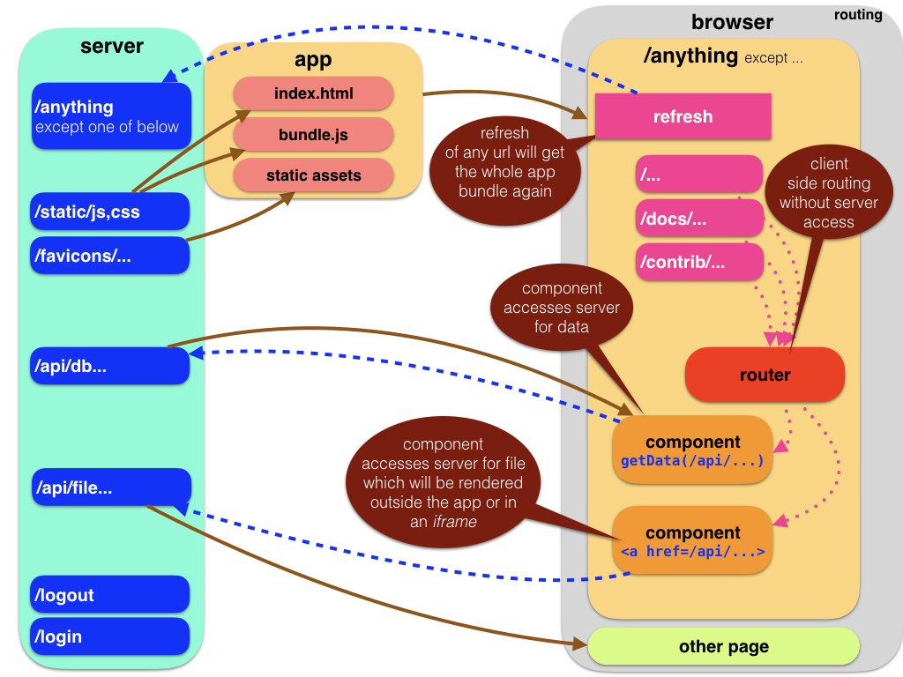

Client
=============================================================================================
## Entry point

At the client side, the app starts in
[main](Components#main).

The first priority is to create a
Redux [Provider](React#redux) component, which will be ancestor to all other components.

## Routing
The second priority is to set up the routes configuration, i.e. the way urls give rise to activating certain components.

We are still talking about *client* side routing.

Server
=============================================================================================
At the *server* there are other rules that link urls to behaviour.

Here are a few rules that capture how routing works in a Single Page App (SPA) like this,
and the diagram visualizes the same logic.

## Fall-back behaviour
The server responds to any url with sending the
[index]({{site.serverBase}}/views/index.tpl)
page, which also causes the bundled app in [dist]({{site.repBase}}/static/dist) to load.

The server's rules are very simple:
no matter what the url, respond with the whole app.
The response is static, it is always the same.
The client has to figure out what component(s) of the app to show and where, based on the details of the url.
This behaviour is needed to cater for the case that the user hits the browser's refresh button.
At that moment, the current url might be a deep path, and we cannot expect the server to know those paths.
The best the server can do is to send the whole app again.

## Special behaviour
There are a few exceptions, though:

### Static
If the url points to a static file,
i.e. a file under `/static/`, the server will respond with the file contents.
Otherwise there was no way to serve the static javascript app in the first place.

### Api
If the url points to `/api/`,
the server will respond in a variety of ways, depending on the rest of the url.
By means of these `/api/` urls the client can ask for additional data services, from file system or database.
The server side routing in
[index.py]({{site.serverBase}}/index.py)
maps these urls to specific controllers that fetch and assemble the requested data.

Not only the client app can access this [api](API), you can too.
